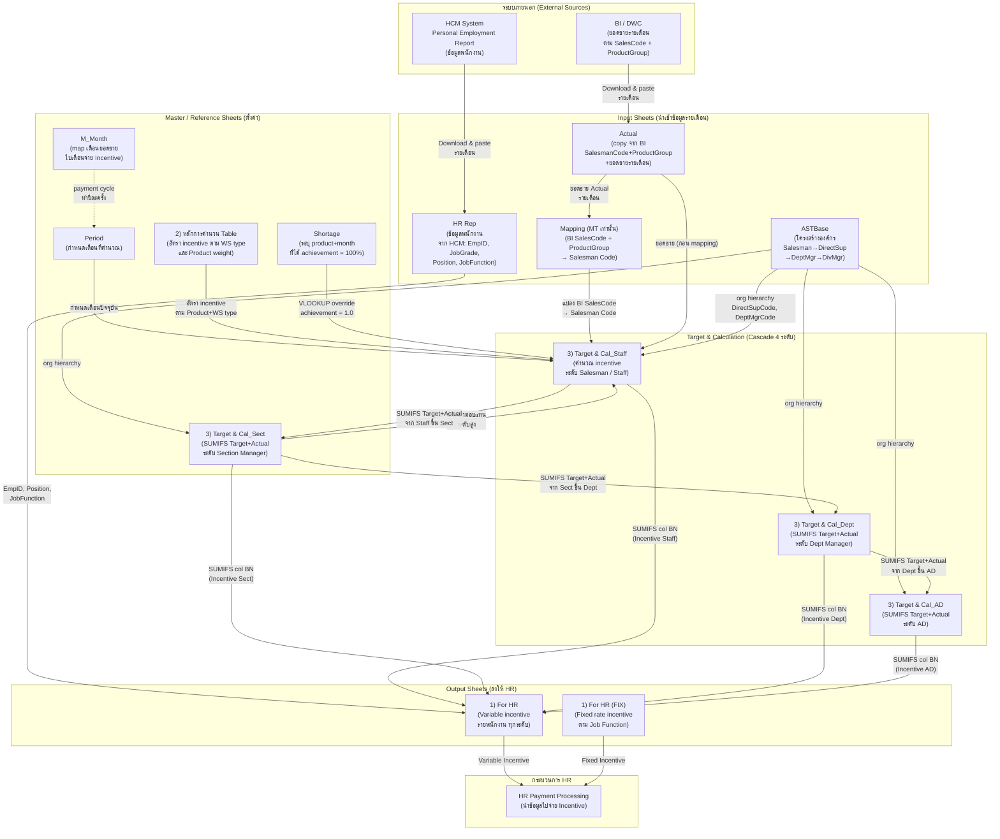
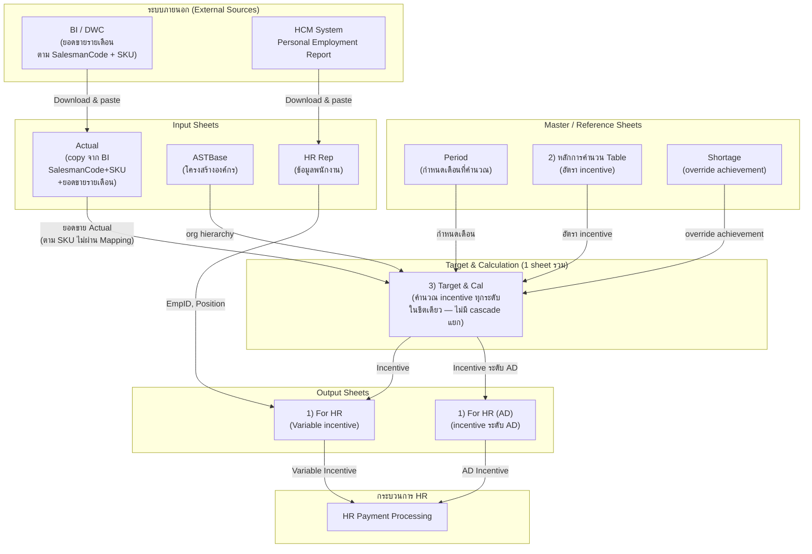
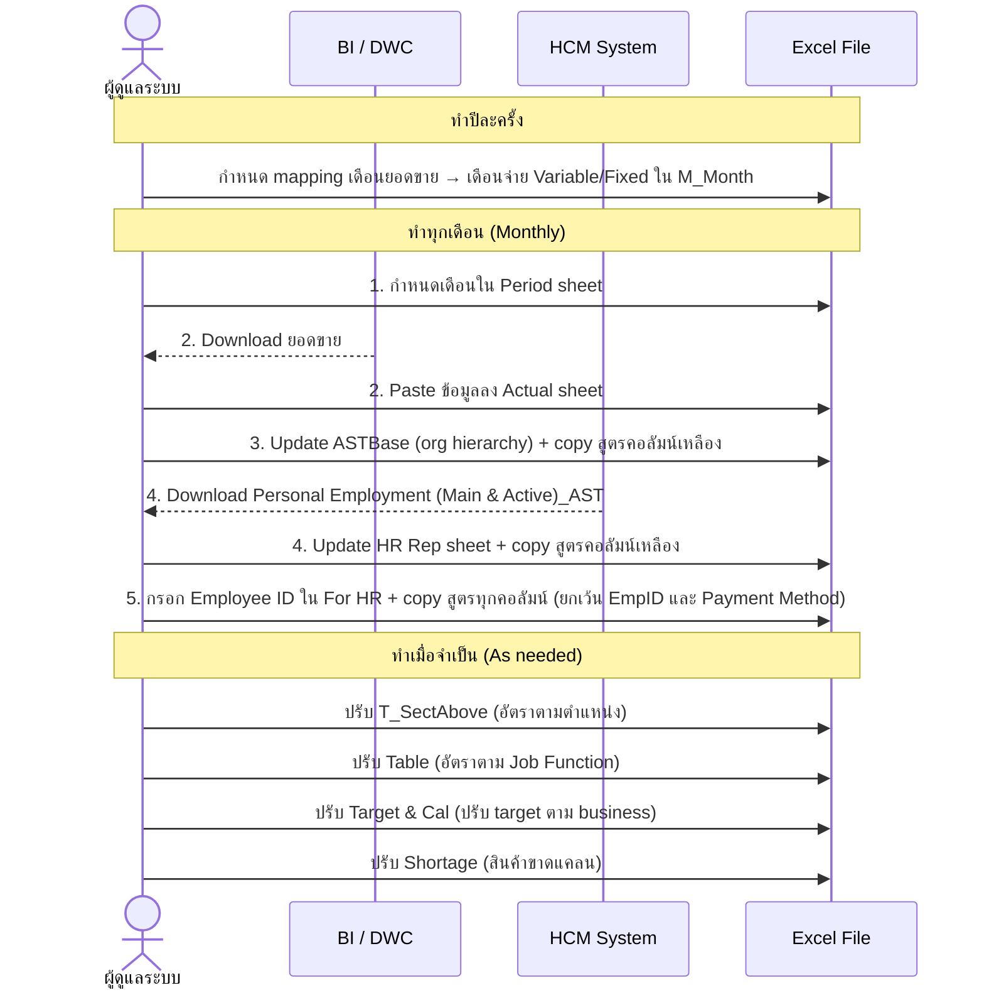

# 01. Data Flow Diagram — AJT Sale Incentive (MT & TT)

**เวอร์ชัน:** Draft v0.1  
**วันที่:** 2026-06-12  
**อ้างอิงจาก:** Guide sheet (MT), Raw Extracts MT/TT, 03.Calculation-Logic v0.2

---

## 1. ภาพรวม Data Flow (MT)



---

## 2. ภาพรวม Data Flow (TT)



---

## 3. ความต่างหลัก MT vs TT

| ด้าน | MT | TT |
|------|----|----|
| การ map ยอดขาย | BI SalesCode → Salesman ผ่าน **Mapping** sheet (1 บัญชีมีหลาย salesman ตาม product group) | BI SalesmanCode ตรงกับ Salesman Code ได้เลย **ไม่มี Mapping** |
| โครงสร้าง Target & Cal | **4 sheets แยก** Staff / Sect / Dept / AD (cascade) | **1 sheet รวม** ทุกระดับ |
| Output fixed rate | **1) For HR (FIX)** แยกต่างหาก + มี sheet `ค่าตอบแทนการขายในอัตราคงที่` | **1) For HR (AD)** รวมระดับ AD |
| หน่วยการวัด | **Product Group** (เช่น AJ, RD, BD...) | **SKU** (รหัสสินค้าเฉพาะ) |
| Guide sheet | มี (อธิบาย Step-by-Step) | ไม่มี |

---

## 4. ลำดับการทำงานรายเดือน (ตาม Guide MT)



---

## 5. Sheet Dependency Chain (MT)

```mermaid
flowchart LR
    A[M_Month] --> B[Period]
    C[ASTBase] --> D[HR Rep]
    B --> E[3)Target & Cal_Staff]
    F[Actual + Mapping] --> E
    G[2)Table + T_SectAbove] --> E
    H[Shortage] --> E
    E -->|SUMIFS| I[3)Target & Cal_Sect]
    I -->|SUMIFS| J[3)Target & Cal_Dept]
    J -->|SUMIFS| K[3)Target & Cal_AD]
    D --> L[1) For HR]
    E -->|col BN| L
    I -->|col BN| L
    J -->|col BN| L
    K -->|col BN| L
    L --> M[HR Payment]
    N[ค่าตอบแทนคงที่] --> O[1) For HR FIX]
    O --> M
```

---

## 6. หมายเหตุและคำถามค้างคา

| # | ประเด็น | สถานะ |
|---|---------|-------|
| 1 | Aji Plus / RDQ / RDM / RDNS sheets — มี Actual_* sheets แยก, มี calculation sheets แยก — ยังไม่ชัดว่า flow ต่างจาก main products อย่างไร | ✅ วิเคราะห์แล้ว → [02.Sheet-Understanding/MT/11_Special-Product-Incentive](../02.Sheet-Understanding/MT/11_Special-Product-Incentive_AjiPlus-RDQ-RDM-RDNS.md) — เป็น scheme คำนวณแยกของสินค้า G2 (GD) แต่ **ยังไม่ wire เข้า For HR** (เหลือ Open Q SP-1…SP-6) |
| 2 | Sales Target sheet — บทบาทใน flow ยังไม่ชัด (อาจเป็น input ของ Target & Cal) | ❓ ต้องยืนยัน |
| 3 | T_SectAbove ใน TT — มีอยู่หรือไม่ / ชื่อ sheet ต่างไหม | ❓ ต้องตรวจ |
