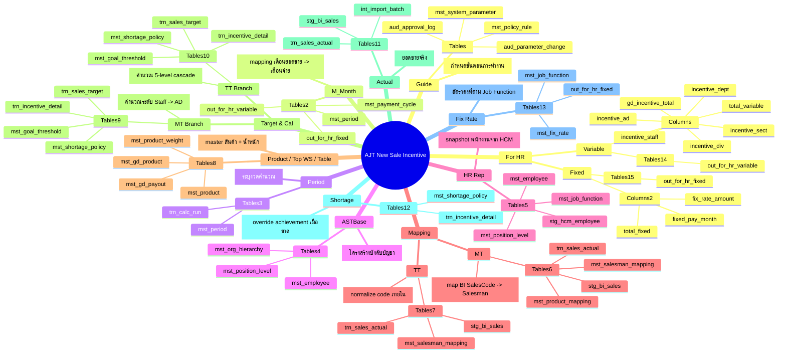

# Sheet-to-Database Mind Map

วันที่: 2026-06-14
Scope: AJT New Sale Incentive System

## อ่านภาพรวม
- ด้านบนคือ Sheet ที่คนทำงานเห็นในไฟล์ต้นทาง
- ชั้นถัดมาคือ Table group ที่รองรับแต่ละ Sheet
- MT ใช้ mapping ระหว่าง BI code -> Salesman code และคำนวณ cascade 4 ระดับ
- TT ใช้ SKU-based logic และขยายผลเป็น 5-level cascade โดยมี `incentive_div` ใน output
