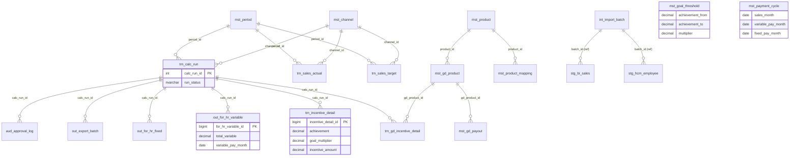
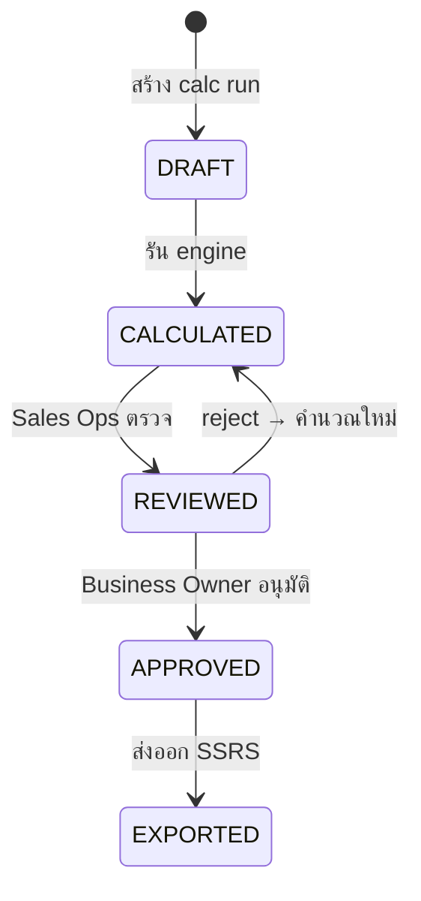

# Database Design — AJT New Sale Incentive System
**Version:** v1.0  
**Date:** 2026-06-13  
**Database:** AJT_SIS (SQL Server 2022)  
**Schema:** dbo  
**Status:** Design Complete + Executed on DB (POC Phase)

---

## Table of Contents

1. [Overview](#1-overview)
2. [Table Groups](#2-table-groups)
3. [Entity Relationship Diagram](#3-entity-relationship-diagram)
4. [Master / Parameter / Config Tables](#4-master--parameter--config-tables)
5. [Interface / Staging Tables](#5-interface--staging-tables)
6. [Transaction Tables](#6-transaction-tables)
7. [Output Tables](#7-output-tables)
8. [Audit Tables](#8-audit-tables)
9. [Data Dictionary Summary](#9-data-dictionary-summary)
10. [Naming Conventions](#10-naming-conventions)
11. [DDL Execution Order](#11-ddl-execution-order)
12. [Cross-Document Links](#12-cross-document-links)

---

## 1. Overview

ฐานข้อมูล **AJT_SIS** รองรับการคำนวณ Incentive พนักงานขาย AJT 4 ช่องทาง (MT / TT / S&I / Laos) และออกแบบเป็นตารางแบบ end-to-end ตั้งแต่รับข้อมูลเข้า คำนวณ ส่งออก และ audit:

| กลุ่ม | จำนวนตาราง | วัตถุประสงค์ |
|---|---|---|
| Master / Parameter / Config | 19 | ข้อมูลหลัก policy เงื่อนไข |
| Interface / Staging | 3 | รับข้อมูล inbound จาก BI/DWC + HCM |
| Transaction | 5 | เป้า, ยอดขายจริง, ผลคำนวณ |
| Output (For HR) | 3 | ผลลัพธ์ส่ง HR ทั้ง Variable + Fixed |
| Audit | 2 | บันทึกการเปลี่ยนแปลง parameter + approval |
| **รวม** | **32** | |

---

## 2. Table Groups

### 2.1 Master / Parameter / Config (prefix: `mst_`)

| ตาราง | คำอธิบาย |
|---|---|
| `mst_channel` | ช่องทางขาย MT / TT / S&I / Laos (รวม calc_type) |
| `mst_position_level` | ระดับตำแหน่ง STAFF → AD (5 ระดับ) |
| `mst_job_function` | ประเภทงาน / กลุ่ม JF |
| `mst_employee` | ข้อมูลพนักงาน (sync จาก HCM) |
| `mst_org_hierarchy` | โครงสร้างองค์กร (parent-child) |
| `mst_product` | สินค้า Master |
| `mst_product_mapping` | mapping Account BI → Salesman Code (MT) |
| `mst_salesman_mapping` | mapping Salesman TT → Internal Code |
| `mst_period` | ปฏิทินรอบ FY2026-04 → FY2027-03 |
| `mst_payment_cycle` | ตารางวันจ่าย Variable/Fixed ต่อเดือนขาย |
| `mst_goal_threshold` | เกณฑ์ achievement → multiplier (step-down) |
| `mst_incentive_rate` | Incentive Base Rate ต่อ position/channel |
| `mst_product_weight` | น้ำหนักสินค้า ต่อ position/channel |
| `mst_shortage_policy` | policy Shortage (override achievement เมื่อขาด) |
| `mst_fix_rate` | อัตรา Fixed Incentive ต่อ Job Function |
| `mst_gd_product` | สินค้า GD Special Incentive |
| `mst_gd_payout` | ตาราง payout step GD ต่อ achievement |
| `mst_system_parameter` | พารามิเตอร์ระบบ (key-value, effective date) |
| `mst_policy_rule` | Business Rule สำคัญที่ต้องอนุมัติ |

### 2.2 Interface / Staging (prefix: `stg_` / `int_`)

| ตาราง | คำอธิบาย |
|---|---|
| `stg_bi_sales` | ยอดขายดิบจาก BI/DWC (MT + TT) ก่อน validate |
| `stg_hcm_employee` | ข้อมูลพนักงานดิบจาก HCM ก่อน validate |
| `int_import_batch` | log ชุดนำเข้าข้อมูล (status/count summary) |

### 2.3 Transaction (prefix: `trn_`)

| ตาราง | คำอธิบาย |
|---|---|
| `trn_sales_target` | เป้าขายต่อ period/salesman/product |
| `trn_sales_actual` | ยอดขายจริงหลัง mapping/validate |
| `trn_calc_run` | header การ run คำนวณ ต่อ period/channel |
| `trn_incentive_detail` | ผล calc detail ต่อ salesman/product (MT/TT) |
| `trn_gd_incentive_detail` | ผล calc GD ต่อ salesman/product |

### 2.4 Output (prefix: `out_`)

| ตาราง | คำอธิบาย |
|---|---|
| `out_for_hr_variable` | ผลรวม Variable pay ต่อพนักงาน ส่ง HR |
| `out_for_hr_fixed` | ผลรวม Fixed pay ต่อพนักงาน ส่ง HR |
| `out_export_batch` | log การ export ไฟล์ SSRS |

### 2.5 Audit (prefix: `aud_`)

| ตาราง | คำอธิบาย |
|---|---|
| `aud_parameter_change` | บันทึกการแก้ไข master/parameter table |
| `aud_approval_log` | บันทึก workflow อนุมัติ ต่อ calc_run |

### 2.6 Sheet-to-Database Alignment (อิงโฟลเดอร์ 4.System Analyst and Design)

#### 2.6.1 MT View (Sheet -> Table -> Column)

| Sheet | Table | Column ที่ผูกตรง | บทบาท |
|---|---|---|---|
| Guide | `mst_policy_rule` | `rule_code`, `rule_value`, `approval_status` | เก็บกติกาธุรกิจที่ต้องอนุมัติ |
| M_Month | `mst_payment_cycle` | `sales_month`, `variable_pay_month`, `fixed_pay_month` | กำหนดเดือนจ่ายจากเดือนขาย |
| Period | `mst_period` | `period_code`, `sales_month`, `status` | ระบุงวดคำนวณหลัก |
| Period | `trn_calc_run` | `period_id`, `channel_id`, `run_status` | เปิด/ติดตามรอบคำนวณ |
| ASTBase | `mst_org_hierarchy` | `effective_month`, `salesman_code`, `direct_sup_code`, `dept_mgr_code`, `div_mgr_code`, `ad_code` | รองรับโครงสร้าง cascade |
| HR Rep | `stg_hcm_employee` | `data_month`, `employee_code`, `position_code`, `job_function_code`, `channel_code` | รับข้อมูลพนักงานก่อน validate |
| HR Rep | `mst_employee` | `employee_code`, `channel_id`, `job_function_id`, `position_level_id` | พนักงาน master ที่ใช้คำนวณ |
| Mapping | `mst_product_mapping` | `source_system`, `source_product_code`, `target_product_id`, `mapping_type` | map รหัส BI -> สินค้าในระบบ |
| Mapping | `mst_salesman_mapping` | `effective_month`, `bi_sales_code`, `product_group_code`, `salesman_code` | map BI account/product group -> salesman |
| Actual | `stg_bi_sales` | `data_month`, `channel_code`, `bi_sales_code`, `product_code`, `actual_amount` | รับยอดขายดิบ MT |
| Actual | `trn_sales_actual` | `period_id`, `channel_id`, `salesman_code`, `product_code`, `actual_amount` | ยอดขายจริงหลัง mapping |
| Top WS / Table | `mst_product_weight` | `channel_id`, `product_id`, `ws_type`, `weight_percent` | น้ำหนักสินค้าในการคำนวณ |
| T_SectAbove | `mst_incentive_rate` | `channel_id`, `position_level_id`, `ws_type`, `rate_new` | base rate ตามระดับตำแหน่ง |
| Target & Cal | `trn_sales_target` | `period_id`, `channel_id`, `salesman_code`, `product_code`, `target_amount` | เป้าราย product group |
| Target & Cal | `trn_incentive_detail` | `calc_run_id`, `salesman_code`, `position_level_code`, `product_code`, `achievement`, `goal_multiplier`, `incentive_amount` | ผลคำนวณทุกระดับของ MT |
| Shortage | `mst_shortage_policy` | `product_id`, `shortage_month`, `override_achievement` | override achievement กรณีขาดสินค้า |
| Fix Rate | `mst_fix_rate` | `channel_id`, `job_function_id`, `amount`, `effective_from` | อัตราคงที่ตาม JF |
| For HR | `out_for_hr_variable` | `calc_run_id`, `employee_code`, `incentive_staff`, `incentive_sect`, `incentive_dept`, `incentive_ad`, `total_variable` | ผล Variable ส่ง HR |
| For HR (FIX) | `out_for_hr_fixed` | `calc_run_id`, `employee_code`, `job_function_code`, `fixed_pay_month`, `total_fixed` | ผล Fixed ส่ง HR |

#### 2.6.2 TT View (Sheet -> Table -> Column)

| Sheet | Table | Column ที่ผูกตรง | บทบาท |
|---|---|---|---|
| Guide | `mst_policy_rule` | `rule_code`, `rule_value`, `approval_status` | เก็บกติกาธุรกิจที่ต้องอนุมัติ |
| M_Month | `mst_payment_cycle` | `sales_month`, `variable_pay_month`, `fixed_pay_month` | กำหนดเดือนจ่ายจากเดือนขาย |
| Period | `mst_period` | `period_code`, `sales_month`, `status` | ระบุงวดคำนวณหลัก |
| Period | `trn_calc_run` | `period_id`, `channel_id`, `run_status` | เปิด/ติดตามรอบคำนวณ |
| ASTBase | `mst_org_hierarchy` | `effective_month`, `salesman_code`, `direct_sup_code`, `dept_mgr_code`, `div_mgr_code`, `ad_code` | โครงสร้าง 5-level สำหรับ TT |
| HR Rep | `stg_hcm_employee` | `data_month`, `employee_code`, `position_code`, `job_function_code`, `channel_code` | รับข้อมูลพนักงานก่อน validate |
| HR Rep | `mst_employee` | `employee_code`, `channel_id`, `job_function_id`, `position_level_id` | พนักงาน master ที่ใช้คำนวณ |
| Mapping (TT) | `mst_salesman_mapping` | `effective_month`, `salesman_code` | ใช้กรณี normalize code ภายใน (TT ไม่ต้อง map BI sales code แบบ MT) |
| Actual | `stg_bi_sales` | `data_month`, `channel_code`, `salesman_code`, `product_code`, `actual_amount` | รับยอดขายดิบ TT (SKU) |
| Actual | `trn_sales_actual` | `period_id`, `channel_id`, `salesman_code`, `product_code`, `actual_amount` | ยอดขายจริงหลัง validate |
| Product / Top WS / Table | `mst_product`, `mst_product_weight` | `product_code`, `product_group_code`, `weight_percent` | master สินค้าและน้ำหนักคำนวณ |
| T_SectAbove | `mst_incentive_rate` | `channel_id`, `position_level_id`, `ws_type`, `rate_new` | base rate ตามระดับตำแหน่ง |
| Target & Cal | `trn_sales_target` | `period_id`, `channel_id`, `salesman_code`, `product_code`, `target_amount` | เป้าราย SKU |
| Target & Cal | `trn_incentive_detail` | `calc_run_id`, `salesman_code`, `position_level_code`, `product_code`, `achievement`, `goal_multiplier`, `incentive_amount` | ผลคำนวณ TT ครบ STAFF/SECT/DEPT/DIV/AD |
| Shortage | `mst_shortage_policy` | `product_id`, `shortage_month`, `override_achievement` | override achievement กรณีขาดสินค้า |
| Fix Rate | `mst_fix_rate` | `channel_id`, `job_function_id`, `amount`, `effective_from` | อัตราคงที่ตาม JF |
| For HR | `out_for_hr_variable` | `calc_run_id`, `employee_code`, `incentive_staff`, `incentive_sect`, `incentive_dept`, `incentive_div`, `incentive_ad`, `total_variable` | ผล Variable ส่ง HR (TT มี division component) |
| For HR (FIX) | `out_for_hr_fixed` | `calc_run_id`, `employee_code`, `job_function_code`, `fixed_pay_month`, `total_fixed` | ผล Fixed ส่ง HR |

> หมายเหตุ: จุดที่เป็นคำว่า "mappong" ในคำขอ ตีความเป็น "mapping" และแยก matrix ตามมุมมอง MT/TT ให้ชัดในระดับ Sheet -> Table -> Column

---

## 3. Entity Relationship Diagram



---

## 4. Master / Parameter / Config Tables

### 4.1 mst_channel

| คอลัมน์ | ชนิดข้อมูล | Nullable | คำอธิบาย |
|---|---|---|---|
| channel_id | INT IDENTITY PK | NO | PK auto |
| channel_code | NVARCHAR(20) UQ | NO | MT / TT / SI / LAOS |
| channel_name_th | NVARCHAR(100) | NO | ชื่อภาษาไทย |
| channel_name_en | NVARCHAR(100) | YES | ชื่อภาษาอังกฤษ |
| calc_type | NVARCHAR(50) | NO | CASCADE_4_LEVEL / SINGLE_SHEET_5_LEVEL_AVG / SINGLE_SHEET |
| is_active | BIT | NO | 1=ใช้งาน |

**ข้อมูลตัวอย่าง:**

| channel_code | channel_name_th | calc_type |
|---|---|---|
| MT | Modern Trade | CASCADE_4_LEVEL |
| TT | Traditional Trade | SINGLE_SHEET_5_LEVEL_AVG |
| SI | S&I | CASCADE_4_LEVEL |
| LAOS | Laos | SINGLE_SHEET |

> หมายเหตุเชิงตรรกะ: TT จัดเก็บในรูปแบบ `SINGLE_SHEET_5_LEVEL_AVG` โดย engine คำนวณเป็น **5-level cascade (STAFF → SECT_MGR → DEPT_MGR → DIV_MGR → AD)**
> โดยใช้ aggregate สูตร `AVERAGEIFS` ที่ระดับผู้บังคับบัญชาแต่ละชั้น

---

### 4.2 mst_goal_threshold (Step-down policy)

| คอลัมน์ | ชนิดข้อมูล | คำอธิบาย |
|---|---|---|
| goal_threshold_id | INT IDENTITY PK | |
| achievement_from | DECIMAL(9,4) | >= ค่านี้ใช้ multiplier นี้ |
| achievement_to | DECIMAL(9,4) NULL | < ค่านี้ (NULL = ไม่มีขีด) |
| multiplier | DECIMAL(9,4) | GOAL value ที่ใช้คำนวณ |
| sequence_no | INT | ลำดับ lookup |

**ข้อมูลตัวอย่าง:**

| achievement_from | achievement_to | multiplier | หมายเหตุ |
|---|---|---|---|
| 0.0000 | 0.8999 | 0.0000 | < 90% ไม่ได้ |
| 0.9000 | 0.9499 | 0.9000 | 90%–94% |
| 1.0000 | 1.0299 | 1.0000 | 100%–102% |
| 1.0600 | 1.0999 | 1.0600 | 106%–109% (OQ-1) |
| 1.3000 | NULL | 1.3000 | ≥ 130% (cap) |

---

### 4.3 mst_payment_cycle

| sales_month | variable_pay_month | fixed_pay_month |
|---|---|---|
| 2026-04-01 | 2026-06-01 | 2026-05-01 |
| 2026-05-01 | 2026-07-01 | 2026-06-01 |
| … | … | … |
| 2027-03-01 | 2027-05-01 | 2027-04-01 |

> Fixed จ่ายก่อน Variable 1 เดือนในทุกรอบ

---

## 5. Interface / Staging Tables

### 5.1 stg_bi_sales (BI/DWC Sales Import)

| คอลัมน์ | ชนิดข้อมูล | คำอธิบาย |
|---|---|---|
| stg_bi_sales_id | BIGINT IDENTITY PK | |
| batch_id | NVARCHAR(50) | รหัสชุดนำเข้า |
| source_system | NVARCHAR(50) | BI / DWC |
| data_month | DATE | เดือนยอดขาย |
| channel_code | NVARCHAR(20) | MT / TT |
| bi_sales_code | NVARCHAR(50) | Account code (MT เท่านั้น) |
| salesman_code | NVARCHAR(50) | Salesman code (TT เท่านั้น) |
| product_code | NVARCHAR(50) | Product Group / SKU |
| actual_amount | DECIMAL(18,2) | ยอดขาย (THB) |
| status | NVARCHAR(20) | PENDING / VALIDATED / ERROR / PROCESSED |
| error_message | NVARCHAR(1000) | ข้อผิดพลาด (ถ้ามี) |

**Flow:** stg_bi_sales → validate → trn_sales_actual

---

### 5.2 stg_hcm_employee (HCM Employee Import)

| คอลัมน์ | ชนิดข้อมูล | คำอธิบาย |
|---|---|---|
| stg_hcm_employee_id | BIGINT IDENTITY PK | |
| batch_id | NVARCHAR(50) | |
| data_month | DATE | เดือนข้อมูล |
| employee_code | NVARCHAR(50) | รหัสพนักงาน |
| employee_name_th | NVARCHAR(200) | ชื่อภาษาไทย |
| position_code | NVARCHAR(50) | map → mst_position_level |
| job_function_code | NVARCHAR(50) | map → mst_job_function |
| channel_code | NVARCHAR(20) | map → mst_channel |
| employment_status | NVARCHAR(30) | Active / Inactive |
| status | NVARCHAR(20) | PENDING / PROCESSED / ERROR |

**Flow:** stg_hcm_employee → validate → mst_employee (upsert)

---

### 5.3 int_import_batch (Batch Log)

| คอลัมน์ | คำอธิบาย |
|---|---|
| batch_id (PK) | รหัสชุดนำเข้า รูปแบบ: BATCH-{TYPE}-{YYMM}-{SEQ} |
| batch_type | BI_SALES / HCM_EMPLOYEE |
| total_rows | จำนวนแถวทั้งหมด |
| valid_rows / error_rows | นับแยก |
| status | IN_PROGRESS / COMPLETED / FAILED / PARTIAL |

---

## 6. Transaction Tables

### 6.1 trn_calc_run (Calculation Run Header)

Workflow ของสถานะ:



| คอลัมน์ | คำอธิบาย |
|---|---|
| calc_run_id (PK) | |
| period_id (FK) | → mst_period |
| channel_id (FK) | → mst_channel |
| run_status | DRAFT / CALCULATED / REVIEWED / APPROVED / EXPORTED |
| calculated_at / reviewed_at / approved_at / exported_at | timestamp แต่ละ step |
| approved_by | username ผู้อนุมัติ |

---

### 6.2 trn_incentive_detail (Core Calculation Result)

สูตรหลัก:

$$\text{incentive\_amount} = \text{incentive\_base} \times \text{goal\_multiplier} \times \text{product\_weight}$$

| คอลัมน์ | คำอธิบาย |
|---|---|
| incentive_detail_id (PK) | |
| calc_run_id (FK) | → trn_calc_run |
| salesman_code | |
| position_level_code | STAFF / SECT_MGR / DEPT_MGR / DIV_MGR / AD |
| product_code | |
| target_amount | เป้า |
| actual_amount | ยอดจริง |
| achievement | actual / target (4 decimal) |
| shortage_flag | 1 = มี shortage override |
| final_achievement | หลัง shortage override |
| goal_multiplier | lookup จาก mst_goal_threshold |
| incentive_base | จาก mst_incentive_rate |
| product_weight | จาก mst_product_weight |
| incentive_amount | ผลสุดท้าย |

**ตรรกะ TT (Single-sheet แต่คำนวณแบบ 5-level cascade):**

- ระดับ `STAFF`: คำนวณรายคนตามสูตรหลักจาก target/actual ของพนักงานขาย
- ระดับ `SECT_MGR`: ใช้ `AVERAGEIFS` จาก achievement ของ STAFF ที่ขึ้นตรงต่อหัวหน้า Section
- ระดับ `DEPT_MGR`: ใช้ `AVERAGEIFS` จากผลระดับ Section ภายใต้ Department เดียวกัน
- ระดับ `DIV_MGR`: ใช้ `AVERAGEIFS` จากผลระดับ Department ภายใต้ Division เดียวกัน
- ระดับ `AD`: ใช้ `AVERAGEIFS` จากผลระดับ Division ภายใต้ AD เดียวกัน

**ข้อมูลตัวอย่าง (MT / Apr-2026):**

| salesman_code | product | target | actual | ach% | GOAL | base | weight | incentive |
|---|---|---|---|---|---|---|---|---|
| SP001 | AJ | 900,000 | 980,000 | 108.9% | 1.06 | 15,000 | 0.30 | 4,770 |
| SP001 | RD | 500,000 | 540,000 | 108.0% | 1.06 | 8,000 | 0.20 | 1,696 |
| SP002 | AJ | 1,000,000 | 1,100,000 | 110.0% | 1.10 | 15,000 | 0.30 | 4,950 |

---

### 6.3 trn_sales_target / trn_sales_actual

ทั้งสองตารางมีโครงสร้าง UNIQUE ที่ **(period_id, channel_id, salesman_code, product_code)** เพื่อป้องกัน duplicate

---

## 7. Output Tables

### 7.1 out_for_hr_variable

ผลสรุปรายพนักงาน **1 แถว = 1 คน 1 calc_run**

| คอลัมน์ | คำอธิบาย |
|---|---|
| incentive_staff | ส่วน Staff level |
| incentive_sect | ส่วน Section Mgr (cascade) |
| incentive_dept | ส่วน Dept Mgr (cascade) |
| incentive_div | ส่วน Division Mgr (cascade) |
| incentive_ad | ส่วน AD (cascade) |
| gd_incentive_total | GD Special Incentive รวม |
| total_variable | ยอดรวมจ่ายจริง (หลัง floor logic) |
| variable_pay_month | เดือนที่จ่าย (จาก mst_payment_cycle) |

**ข้อมูลตัวอย่าง:**

| employee_code | ชื่อ | variable_pay_month | total_variable |
|---|---|---|---|
| SP001 | นาย ก. ใจดี | 2026-06-01 | 7,261.00 |
| SP002 | นาย ข. รักชาติ | 2026-06-01 | 7,423.00 |
| SM001 | นาย ค. มั่นคง | 2026-06-01 | 3,800.00 |
| TT001 | นาง ง. สดใส | 2026-06-01 | 6,927.50 |
| TT002 | นาย จ. มีสุข | 2026-06-01 | 7,140.00 |
| TDV001 | นาย ฌ. รวมพลัง | 2026-06-01 | 3,625.00 |

---

### 7.2 out_for_hr_fixed

| คอลัมน์ | คำอธิบาย |
|---|---|
| fix_rate_amount | จาก mst_fix_rate |
| total_fixed | ยอดรวม Fixed |
| fixed_pay_month | เดือนที่จ่าย (Fixed จ่ายก่อน Variable 1 เดือน) |

---

## 8. Audit Tables

### 8.1 aud_parameter_change

บันทึกทุกครั้งที่แก้ master/parameter table สำคัญ:

| คอลัมน์ | คำอธิบาย |
|---|---|
| table_name | ชื่อตารางที่แก้ |
| record_id | PK ของแถว |
| field_name | ชื่อคอลัมน์ |
| old_value / new_value | ก่อน/หลัง |
| change_reason | บังคับ (บันทึก rationale) |
| changed_by / changed_at | ผู้แก้ / วันเวลา (DATETIME2(3)) |

---

### 8.2 aud_approval_log

บันทึก workflow ทุก step ของ trn_calc_run:

| action | from → to | ผู้ดำเนิน |
|---|---|---|
| SUBMIT | DRAFT → CALCULATED | sales_ops |
| REVIEW | CALCULATED → REVIEWED | sales_ops |
| APPROVE | REVIEWED → APPROVED | business_owner |
| REJECT | REVIEWED → CALCULATED | business_owner |
| EXPORT | APPROVED → EXPORTED | sales_ops |

---

## 9. Data Dictionary Summary

| Prefix | กลุ่ม | จำนวนตาราง |
|---|---|---|
| mst_ | Master / Parameter / Config | 19 |
| stg_ | Staging (Interface Landing) | 2 |
| int_ | Interface Batch Log | 1 |
| trn_ | Transaction (Calc) | 5 |
| out_ | Output (For HR) | 3 |
| aud_ | Audit / Change Log | 2 |
| **รวม** | | **32** |

### 9.1 Row Count และ Coverage ล่าสุดจากการรันจริง

ข้อมูลด้านล่างอ้างอิงผลการรันจริงหลัง execute ครบลำดับ
01_ajt_sis_poc_master_tables.sql -> 02_ajt_sis_poc_seed_data.sql -> 03_ajt_sis_transaction_tables.sql -> 04_ajt_sis_sample_data_full.sql
บนฐาน AJT_SIS เมื่อวันที่ 2026-06-13

| กลุ่ม | จำนวนตาราง | ตารางที่มีข้อมูล | Coverage |
|---|---:|---:|---:|
| Master / Parameter / Config | 19 | 19 | 100% |
| Interface / Staging | 3 | 3 | 100% |
| Transaction | 5 | 5 | 100% |
| Output (For HR) | 3 | 3 | 100% |
| Audit | 2 | 2 | 100% |
| **รวม** | **32** | **32** | **100%** |

| ตาราง | Row Count |
|---|---:|
| aud_approval_log | 3 |
| aud_parameter_change | 1 |
| int_import_batch | 3 |
| mst_channel | 4 |
| mst_employee | 5 |
| mst_fix_rate | 6 |
| mst_gd_payout | 40 |
| mst_gd_product | 4 |
| mst_goal_threshold | 10 |
| mst_incentive_rate | 8 |
| mst_job_function | 11 |
| mst_org_hierarchy | 4 |
| mst_payment_cycle | 12 |
| mst_period | 12 |
| mst_policy_rule | 5 |
| mst_position_level | 5 |
| mst_product | 11 |
| mst_product_mapping | 11 |
| mst_product_weight | 6 |
| mst_salesman_mapping | 12 |
| mst_shortage_policy | 1 |
| mst_system_parameter | 4 |
| out_export_batch | 1 |
| out_for_hr_fixed | 3 |
| out_for_hr_variable | 3 |
| stg_bi_sales | 20 |
| stg_hcm_employee | 5 |
| trn_calc_run | 2 |
| trn_gd_incentive_detail | 4 |
| trn_incentive_detail | 6 |
| trn_sales_actual | 12 |
| trn_sales_target | 12 |

หมายเหตุการตรวจสอบ:
- zero_count_tables = 0 (ไม่มีตารางที่ว่าง)
- ข้อความภาษาไทยในคอลัมน์ NVARCHAR ถูกบันทึกและอ่านได้ปกติหลังปรับเป็น Unicode literal (N'...')

---

## 10. Naming Conventions

| รายการ | Convention | ตัวอย่าง |
|---|---|---|
| Table name | `prefix_noun_noun` (snake_case) | `trn_incentive_detail` |
| PK constraint | `PK_tablename` | `PK_trn_calc_run` |
| FK constraint | `FK_tablename_ref` | `FK_trn_calc_run_period` |
| UQ constraint | `UQ_tablename[_suffix]` | `UQ_trn_calc_run` |
| Default constraint | `DF_tablename_colname` | `DF_trn_calc_run_status` |
| Index (non-PK) | `IX_tablename_colname` | `IX_trn_incentive_detail_salesman` |
| Date type | DATETIME2(0) ทั่วไป, DATETIME2(3) สำหรับ Audit | |
| Timestamp column | `created_at`, `updated_at` (UTC) | SYSUTCDATETIME() |
| Status column | NVARCHAR(20-30) ใช้ค่า UPPER_SNAKE_CASE | `'APPROVED'`, `'IN_PROGRESS'` |
| Boolean | BIT, default 1 = active/true | `is_active`, `shortage_flag` |

---

## 11. DDL Execution Order

```
01_ajt_sis_poc_master_tables.sql    → 19 master tables
02_ajt_sis_poc_seed_data.sql        → Seed data (channel, position, goal, payment_cycle)
03_ajt_sis_transaction_tables.sql   → Interface + Transaction + Output + Audit tables
04_ajt_sis_sample_data_full.sql     → Sample data ทุกกลุ่ม (Apr-2026 MT/TT scenario รวม TT 5-level cascade + AVERAGEIFS trace)
```

ทุกไฟล์เป็น **idempotent** — รันซ้ำได้โดยไม่เกิด error

---

## 12. Cross-Document Links

| เอกสาร | เนื้อหาที่เกี่ยวข้อง |
|---|---|
| [BRD/SRS](../5.Docs/BRD-SRS_AJT-New-Sale-Incentive_Draft-v0.1_2026-06-12.md) | Data Requirements, Out-of-Scope |
| [System Architecture Design](../5.Docs/System-Architecture-Design_AJT-New-Sale-Incentive_v1.0_2026-06-13.md) | IR-001/002/003 (Integration), Data Architecture |
| [System Flow Design](../5.Docs/System-Flow-Design_AJT-New-Sale-Incentive_v1.0_2026-06-13.md) | MT cascade flow, TT single-sheet, GD, Fixed |
| [Business Process Design](../5.Docs/Business-Process-Design_AJT-New-Sale-Incentive_v1.0_2026-06-13.md) | Process cadence, step detail |
| [Decision Log](../5.Docs/Decision-Log_Template_Open-Questions_2026-06-13.md) | OQ-1 (goal threshold 108%), OQ-2 (Laos), OQ-3 (GD engine) |
| [DDL Files](../../environment/ddl/) | SQL scripts ทั้งหมด |
