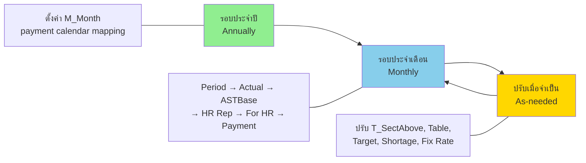
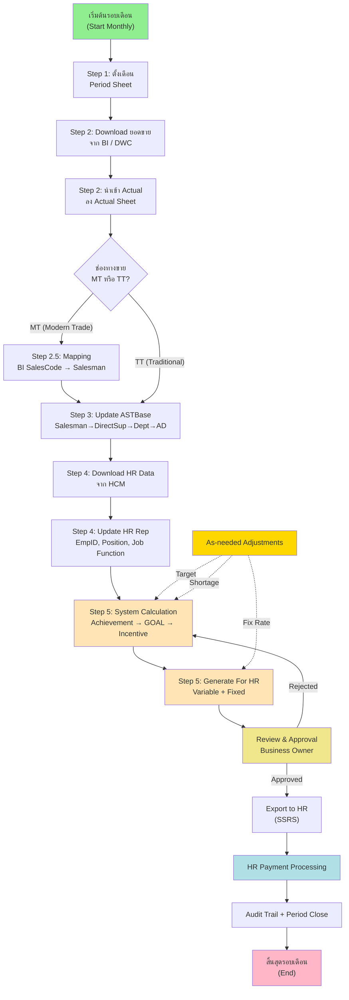
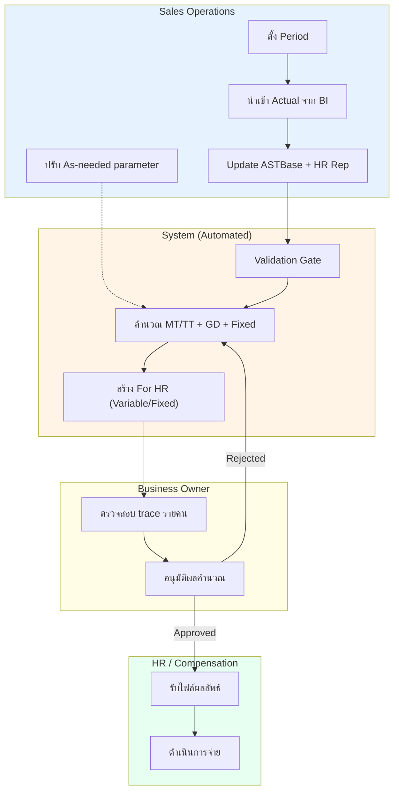
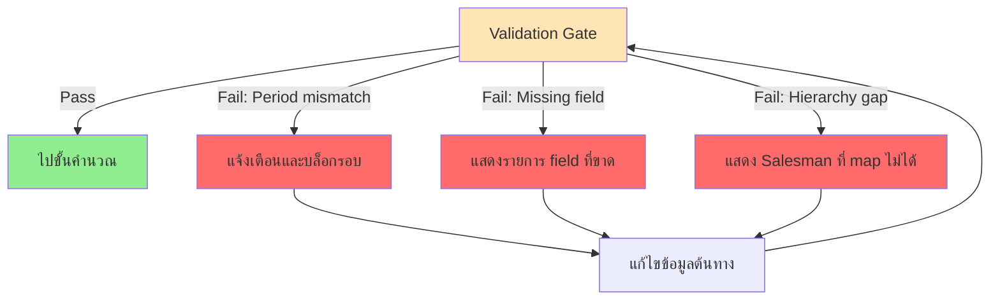
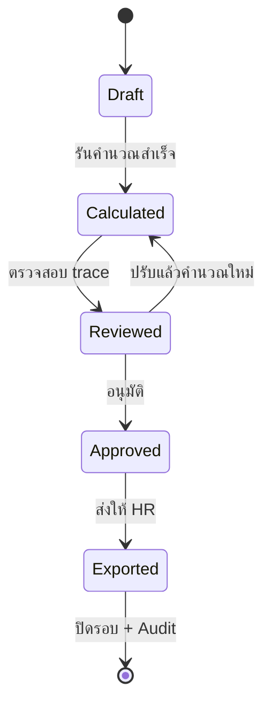

# Business Process Design — AJT New Sale Incentive

เวอร์ชัน: v1.0
วันที่: 2026-06-13
สถานะ: Complete (Design Baseline)
ขอบเขต: กระบวนการธุรกิจของการคำนวณและจ่าย Sales Incentive ทั้ง MT และ TT

อ้างอิงต้นทาง:

- [Sales Incentive System for POC.md](Sales%20Incentive%20System%20for%20POC.md)
- [BRD-SRS_AJT-New-Sale-Incentive_Draft-v0.1_2026-06-12.md](BRD-SRS_AJT-New-Sale-Incentive_Draft-v0.1_2026-06-12.md)
- [4.System Analyst and Design/05.Process-Flow/01_Data-Flow-Diagram.md](../4.System%20Analyst%20and%20Design/05.Process-Flow/01_Data-Flow-Diagram.md)
- [4.System Analyst and Design/06_Sales-Incentive-Guide-Explanation.md](../4.System%20Analyst%20and%20Design/06_Sales-Incentive-Guide-Explanation.md)

---

## 1. วัตถุประสงค์ของเอกสาร

เอกสารนี้อธิบายกระบวนการธุรกิจ (Business Process) ของระบบ AJT New Sale Incentive อย่างสมบูรณ์ ครอบคลุมรอบการทำงาน บทบาทผู้เกี่ยวข้อง จุดควบคุม (control point) เงื่อนไขการตัดสินใจ และการจัดการข้อผิดพลาด เพื่อใช้เป็น baseline สำหรับการออกแบบระบบ การพัฒนา และการทำ UAT

---

## 2. ขอบเขตกระบวนการ (Process Scope)

| ด้าน | รายละเอียด |
| --- | --- |
| รอบการทำงาน | ประจำปี (Annually), ประจำเดือน (Monthly), ปรับเมื่อจำเป็น (As-needed) |
| ช่องทาง | MT (Modern Trade) และ TT (Traditional Trade) |
| จุดเริ่ม | การตั้งค่ารอบเดือนและการนำเข้าข้อมูลยอดขาย/พนักงาน |
| จุดสิ้นสุด | ส่งออกผลลัพธ์ให้ HR และปิดรอบพร้อม Audit Trail |
| นอกขอบเขต | การจ่ายเงินจริงผ่าน Payroll/Banking, การ redesign ระบบต้นทาง |

---

## 3. บทบาทผู้เกี่ยวข้อง (Roles)

| บทบาท | หน้าที่ในกระบวนการ |
| --- | --- |
| Sales Operations | ตั้ง Period, นำเข้า/ตรวจข้อมูล, ปรับ As-needed parameter |
| Business Owner | ตรวจสอบและอนุมัติผลคำนวณก่อนส่ง HR |
| HR / Compensation | รับผลลัพธ์ที่อนุมัติแล้วเพื่อดำเนินการจ่าย |
| Data Team (BI/DWC) | จัดเตรียม feed ยอดขายรายเดือน |
| HCM Owner | จัดเตรียม feed ข้อมูลพนักงาน |
| System (Automated) | คำนวณ achievement, GOAL, cascade, GD, fixed rate และสร้าง output |

---

## 4. ภาพรวมรอบการทำงาน (Process Cadence)

หลักการ:

1. รอบประจำปีตั้งค่าครั้งเดียวเพื่อกำหนด payment calendar (M_Month)
2. รอบประจำเดือนทำซ้ำทุกเดือนตามลำดับขั้นตอนหลัก
3. As-needed ปรับพารามิเตอร์เมื่อมีการเปลี่ยนแปลงเชิงธุรกิจ แล้ววนกลับเข้าสู่การคำนวณ

---

## 5. Business Process Diagram (End-to-End)

---

## 6. Swimlane — ความรับผิดชอบตามบทบาท

---

## 7. รายละเอียดขั้นตอน (Step Detail)

### 7.1 รอบประจำปี (Annually)

| ขั้นที่ | กิจกรรม | Input | Output | ผู้รับผิดชอบ |
| --- | --- | --- | --- | --- |
| A1 | ตั้งค่า M_Month (mapping เดือนยอดขาย → เดือนจ่าย Variable/Fixed) | ปฏิทินจ่ายของปี | ตาราง payment calendar | Sales Operations |

### 7.2 รอบประจำเดือน (Monthly)

| ขั้นที่ | กิจกรรม | Input | Output | ผู้รับผิดชอบ |
| --- | --- | --- | --- | --- |
| M1 | กำหนด Period ของรอบ | เดือนยอดขายเป้าหมาย | Period ที่ใช้คำนวณ | Sales Operations |
| M2 | Download + นำเข้า Actual | ยอดขายจาก BI/DWC | Actual ในระบบ | Sales Operations |
| M3 | Update ASTBase | โครงสร้างองค์กรล่าสุด | Hierarchy mapping | Sales Operations |
| M4 | Update HR Rep | Personal Employment จาก HCM | ข้อมูลพนักงาน active | Sales Operations |
| M5 | คำนวณและสร้าง For HR | Actual + Master + Hierarchy | ผลลัพธ์ Variable/Fixed | System |
| M6 | ตรวจสอบและอนุมัติ | ผลคำนวณ + trace | สถานะ Approved | Business Owner |
| M7 | Export ให้ HR | ผลที่อนุมัติ | ไฟล์ส่ง HR (SSRS) | System |
| M8 | ปิดรอบ + Audit | ผลที่ส่งแล้ว | Period Close + Log | System |

### 7.3 ปรับเมื่อจำเป็น (As-needed)

| ขั้นที่ | กิจกรรม | เงื่อนไขที่ทำ |
| --- | --- | --- |
| N1 | ปรับ T_SectAbove | เปลี่ยนอัตราตามระดับตำแหน่ง |
| N2 | ปรับ Table | เปลี่ยนอัตราตาม Job Function |
| N3 | ปรับ Target & Cal | เปลี่ยนเป้าหมายตามสภาพธุรกิจ |
| N4 | ปรับ Shortage | สินค้าขาดราย product/เดือน |
| N5 | ปรับ Fix Rate | เปลี่ยนอัตราคงที่รายพนักงาน |

---

## 8. จุดควบคุม (Control Points)

| รหัส | จุดควบคุม | เกณฑ์ผ่าน |
| --- | --- | --- |
| CP-1 | Period alignment | ข้อมูลยอดขายและพนักงานต้องอยู่ในเดือนเดียวกับ Period |
| CP-2 | Data completeness | required fields ครบและ key ไม่ซ้ำ |
| CP-3 | Hierarchy consistency | Salesman ผูกกับสายบังคับบัญชาได้ครบ |
| CP-4 | Approval before export | ต้องมีผู้อนุมัติและเวลาอนุมัติก่อนส่ง HR |
| CP-5 | Audit completeness | ทุกการปรับ As-needed มีผู้แก้ไข เวลา และเหตุผล |

---

## 9. การจัดการข้อผิดพลาด (Exception Handling)

หลักการจัดการ:

1. ตรวจก่อนคำนวณเสมอ (pre-validation) และบล็อกหากไม่ผ่าน
2. แสดง error ที่ชัดเจนพร้อมจุดที่ต้องแก้
3. ให้แก้ที่ต้นทางแล้ววน validate ใหม่ ไม่ข้ามขั้นตอน

---

## 10. สถานะรอบงาน (Process States)

---

## 11. ความเชื่อมโยงกับเอกสารอื่น

| ต้องการดู | ไปที่ |
| --- | --- |
| สถาปัตยกรรมระบบ | [System-Architecture-Design](System-Architecture-Design_AJT-New-Sale-Incentive_v1.0_2026-06-13.md) |
| System Flow MT/TT | [System-Flow-Design](System-Flow-Design_AJT-New-Sale-Incentive_v1.0_2026-06-13.md) |
| ตรรกะการคำนวณ | [03.Calculation-Logic](../4.System%20Analyst%20and%20Design/03.Calculation-Logic/00_%E0%B8%AA%E0%B8%A3%E0%B8%B8%E0%B8%9B%E0%B8%95%E0%B8%A3%E0%B8%A3%E0%B8%81%E0%B8%B0%E0%B8%81%E0%B8%B2%E0%B8%A3%E0%B8%84%E0%B8%B3%E0%B8%99%E0%B8%A7%E0%B8%93_%E0%B8%95%E0%B8%B1%E0%B9%89%E0%B8%87%E0%B8%95%E0%B9%89%E0%B8%99.md) |
| Open Questions / Decision Log | [Decision-Log_Template_Open-Questions](Decision-Log_Template_Open-Questions_2026-06-13.md) |

---

## 12. ประเด็นค้างที่กระทบกระบวนการ (ต้องยืนยัน)

1. รอบ/ขอบเขต Laos Dept ใน TT For HR (AD) ส่งผลต่อ swimlane และ output
2. แนวทางจ่าย GD (รวม For HR หรือแยก) ส่งผลต่อขั้น Export และ Payment
3. Policy จุด 108% → 1.06 ส่งผลต่อความถูกต้องของขั้นคำนวณ

> รายละเอียดและการปิดมติ ใช้ [Decision-Log_Template_Open-Questions](Decision-Log_Template_Open-Questions_2026-06-13.md)
