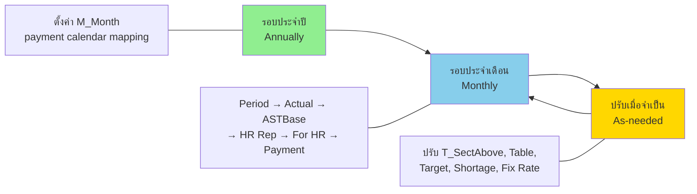
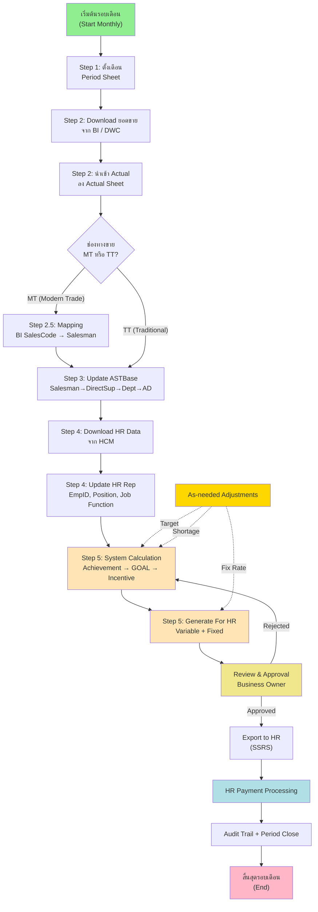
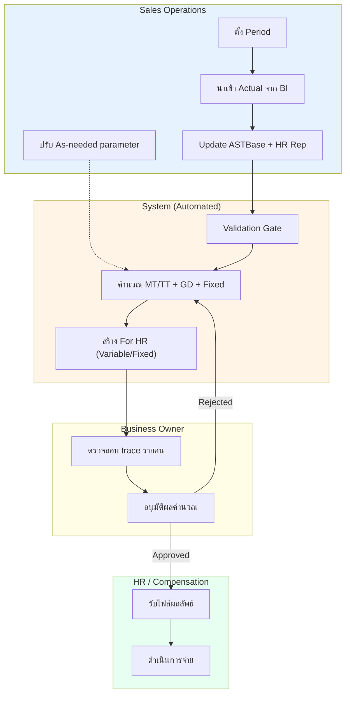
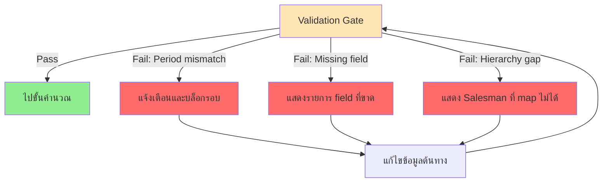
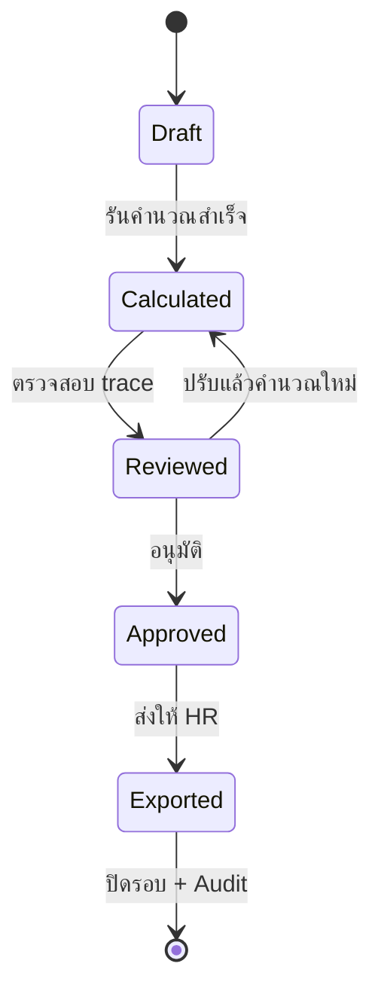

# Business Process Design — AJT New Sale Incentive

เวอร์ชัน: v1.0
วันที่: 2026-06-13
สถานะ: Complete (Design Baseline + Operational Detail)
ขอบเขต: กระบวนการธุรกิจของการคำนวณและจ่าย Sales Incentive ทั้ง MT และ TT (รองรับการขยาย SI/Laos ตาม policy ที่ยืนยัน)

อ้างอิงต้นทาง:

- [Sales Incentive System for POC.md](Sales%20Incentive%20System%20for%20POC.md)
- [BRD-SRS_AJT-New-Sale-Incentive_Draft-v0.1_2026-06-12.md](BRD-SRS_AJT-New-Sale-Incentive_Draft-v0.1_2026-06-12.md)
- [4.System Analyst and Design/05.Process-Flow/01_Data-Flow-Diagram.md](../4.System%20Analyst%20and%20Design/05.Process-Flow/01_Data-Flow-Diagram.md)
- [4.System Analyst and Design/06_Sales-Incentive-Guide-Explanation.md](../4.System%20Analyst%20and%20Design/06_Sales-Incentive-Guide-Explanation.md)

---

## 1. วัตถุประสงค์ของเอกสาร

เอกสารนี้อธิบายกระบวนการธุรกิจ (Business Process) ของระบบ AJT New Sale Incentive อย่างสมบูรณ์ ครอบคลุมรอบการทำงาน บทบาทผู้เกี่ยวข้อง จุดควบคุม (control point) เงื่อนไขการตัดสินใจ และการจัดการข้อผิดพลาด เพื่อใช้เป็น baseline สำหรับการออกแบบระบบ การพัฒนา และการทำ UAT

---

## 2. ขอบเขตกระบวนการ (Process Scope)

| ด้าน | รายละเอียด |
| --- | --- |
| รอบการทำงาน | ประจำปี (Annually), ประจำเดือน (Monthly), ปรับเมื่อจำเป็น (As-needed) |
| ช่องทาง | MT (Modern Trade) และ TT (Traditional Trade) เป็นหลัก, SI/Laos ใช้ตรรกะเทียบเท่าเมื่อเปิดใช้ |
| ข้อมูลเข้า (Inbound) | BI/DWC (ยอดขายรายเดือน), HCM (Personal Employment Main & Active), ASTBase/Hierarchy |
| ข้อมูลออก (Outbound) | For HR Variable, For HR Fixed, SSRS Export, Audit Log |
| จุดเริ่ม | การตั้งค่ารอบเดือนและการนำเข้าข้อมูลยอดขาย/พนักงาน |
| จุดสิ้นสุด | ส่งออกผลลัพธ์ให้ HR และปิดรอบพร้อม Audit Trail |
| นอกขอบเขต | การจ่ายเงินจริงผ่าน Payroll/Banking, การ redesign ระบบต้นทาง |

---

## 3. บทบาทผู้เกี่ยวข้อง (Roles)

| บทบาท | หน้าที่ในกระบวนการ |
| --- | --- |
| Sales Operations | ตั้ง Period, นำเข้า/ตรวจข้อมูล, ปรับ As-needed parameter |
| Business Owner | ตรวจสอบและอนุมัติผลคำนวณก่อนส่ง HR |
| HR / Compensation | รับผลลัพธ์ที่อนุมัติแล้วเพื่อดำเนินการจ่าย |
| Data Team (BI/DWC) | จัดเตรียม feed ยอดขายรายเดือน |
| HCM Owner | จัดเตรียม feed ข้อมูลพนักงาน |
| System (Automated) | คำนวณ achievement, GOAL, cascade, GD, fixed rate และสร้าง output |

---

## 4. ภาพรวมรอบการทำงาน (Process Cadence)

หลักการ:

1. รอบประจำปีตั้งค่าครั้งเดียวเพื่อกำหนด payment calendar (M_Month)
2. รอบประจำเดือนทำซ้ำทุกเดือนตามลำดับขั้นตอนหลัก
3. As-needed ปรับพารามิเตอร์เมื่อมีการเปลี่ยนแปลงเชิงธุรกิจ แล้ววนกลับเข้าสู่การคำนวณ

---

## 5. Business Process Diagram (End-to-End)

---

## 6. Swimlane — ความรับผิดชอบตามบทบาท

---

## 7. รายละเอียดขั้นตอน (Step Detail)

### 7.1 รอบประจำปี (Annually)

| ขั้นที่ | กิจกรรม | Input | Output | ผู้รับผิดชอบ |
| --- | --- | --- | --- | --- |
| A1 | ตั้งค่า M_Month (mapping เดือนยอดขาย → เดือนจ่าย Variable/Fixed) | ปฏิทินจ่ายของปี | ตาราง payment calendar | Sales Operations |

### 7.2 รอบประจำเดือน (Monthly)

| ขั้นที่ | กิจกรรม | Input | Output | ผู้รับผิดชอบ |
| --- | --- | --- | --- | --- |
| M1 | กำหนด Period ของรอบ | เดือนยอดขายเป้าหมาย | Period ที่ใช้คำนวณ | Sales Operations |
| M2 | Download + นำเข้า Actual | ยอดขายจาก BI/DWC | Actual ในระบบ | Sales Operations |
| M3 | Update ASTBase | โครงสร้างองค์กรล่าสุด | Hierarchy mapping | Sales Operations |
| M4 | Update HR Rep | Personal Employment จาก HCM | ข้อมูลพนักงาน active | Sales Operations |
| M5 | คำนวณและสร้าง For HR | Actual + Master + Hierarchy | ผลลัพธ์ Variable/Fixed | System |
| M6 | ตรวจสอบและอนุมัติ | ผลคำนวณ + trace | สถานะ Approved | Business Owner |
| M7 | Export ให้ HR | ผลที่อนุมัติ | ไฟล์ส่ง HR (SSRS) | System |
| M8 | ปิดรอบ + Audit | ผลที่ส่งแล้ว | Period Close + Log | System |

### 7.3 ปรับเมื่อจำเป็น (As-needed)

| ขั้นที่ | กิจกรรม | เงื่อนไขที่ทำ |
| --- | --- | --- |
| N1 | ปรับ T_SectAbove | เปลี่ยนอัตราตามระดับตำแหน่ง |
| N2 | ปรับ Table | เปลี่ยนอัตราตาม Job Function |
| N3 | ปรับ Target & Cal | เปลี่ยนเป้าหมายตามสภาพธุรกิจ |
| N4 | ปรับ Shortage | สินค้าขาดราย product/เดือน |
| N5 | ปรับ Fix Rate | เปลี่ยนอัตราคงที่รายพนักงาน |

### 7.4 Special Product Incentive (GD)

| ขั้นที่ | กิจกรรม | Input | Output | ผู้รับผิดชอบ |
| --- | --- | --- | --- | --- |
| G1 | รับ Target/Actual สินค้า GD | Target/Actual ราย product GD รายเดือน | ชุดข้อมูลพร้อมคำนวณ GD | Sales Operations + Data Team |
| G2 | คำนวณ achievement GD | Actual ÷ Target (ROUND 4) | achievement ราย product GD | System |
| G3 | Lookup payout GD | ตาราง GD payout ตามขั้น achievement | payout รายเดือนราย product | System |
| G4 | รวมผลและจัดเตรียม output | ผล GD รายเดือน/รายปี | ค่า GD พร้อมส่งออก (รวมหรือแยกตาม policy) | System + Business Owner |

หมายเหตุ: วิธีจ่าย GD (รวม For HR หรือแยกไฟล์) ต้องผูกกับมติใน Decision Log ก่อนใช้งาน Production

---

## 8. จุดควบคุม (Control Points)

| รหัส | จุดควบคุม | เกณฑ์ผ่าน |
| --- | --- | --- |
| CP-1 | Period alignment | ข้อมูลยอดขายและพนักงานต้องอยู่ในเดือนเดียวกับ Period |
| CP-2 | Data completeness | required fields ครบและ key ไม่ซ้ำ |
| CP-3 | Hierarchy consistency | Salesman ผูกกับสายบังคับบัญชาได้ครบ |
| CP-4 | Approval before export | ต้องมีผู้อนุมัติและเวลาอนุมัติก่อนส่ง HR |
| CP-5 | Audit completeness | ทุกการปรับ As-needed มีผู้แก้ไข เวลา และเหตุผล |
| CP-6 | Interface completeness | Import BI/HCM ต้องมี batch summary (total/valid/error) ครบ |
| CP-7 | Data reconciliation | ยอดรวม Actual หลัง mapping ต้อง reconcile กับยอดต้นทางตาม tolerance ที่ตกลง |
| CP-8 | Output integrity | For HR Variable/Fixed ต้องมี checksum และจำนวนพนักงานตรงกับรอบที่อนุมัติ |
| CP-9 | Period close governance | ปิดรอบได้เมื่อสถานะ Exported และ Audit ครบเท่านั้น |

---

## 9. การจัดการข้อผิดพลาด (Exception Handling)

หลักการจัดการ:

1. ตรวจก่อนคำนวณเสมอ (pre-validation) และบล็อกหากไม่ผ่าน
2. แสดง error ที่ชัดเจนพร้อมจุดที่ต้องแก้
3. ให้แก้ที่ต้นทางแล้ววน validate ใหม่ ไม่ข้ามขั้นตอน

ตารางจัดการข้อผิดพลาดหลัก:

| Error Code | กรณี | ความรุนแรง | เจ้าของแก้ไข | SLA การตอบสนอง |
| --- | --- | --- | --- | --- |
| E-PERIOD-001 | Sales/HCM ไม่ตรง Period | สูง | Sales Operations + Data Team | ภายใน 4 ชั่วโมงทำการ |
| E-REQ-002 | Required fields ไม่ครบ | กลาง | ผู้ส่งข้อมูลต้นทาง | ภายใน 1 วันทำการ |
| E-MAP-003 | MT Mapping ไม่ครบ | สูง | Sales Operations | ภายใน 4 ชั่วโมงทำการ |
| E-HIER-004 | Hierarchy gap | สูง | Sales Operations + HCM Owner | ภายใน 1 วันทำการ |
| E-APP-005 | ไม่มีผู้อนุมัติแต่ส่งออก | สูง | Business Owner | หยุดส่งออกทันที |

---

## 10. สถานะรอบงาน (Process States)

นิยามสถานะ:

| สถานะ | คำอธิบาย | Exit Criteria |
| --- | --- | --- |
| Draft | เตรียมข้อมูลและพารามิเตอร์ | Validation ผ่าน |
| Calculated | คำนวณเสร็จและสร้างผลเบื้องต้น | มี trace ตรวจสอบได้ |
| Reviewed | Sales Ops/Business ตรวจผลแล้ว | พร้อมอนุมัติ |
| Approved | Business Owner อนุมัติจ่าย | พร้อม export |
| Exported | ส่งออกให้ HR แล้ว | บันทึก export batch และ audit ครบ |

---

## 11. ความเชื่อมโยงกับเอกสารอื่น

| ต้องการดู | ไปที่ |
| --- | --- |
| BRD/SRS หลัก | [BRD-SRS_AJT-New-Sale-Incentive_Draft-v0.1_2026-06-12.md](BRD-SRS_AJT-New-Sale-Incentive_Draft-v0.1_2026-06-12.md) |
| สถาปัตยกรรมระบบ | [System-Architecture-Design](System-Architecture-Design_AJT-New-Sale-Incentive_v1.0_2026-06-13.md) |
| System Flow MT/TT | [System-Flow-Design](System-Flow-Design_AJT-New-Sale-Incentive_v1.0_2026-06-13.md) |
| ตรรกะการคำนวณ | [03.Calculation-Logic](../4.System%20Analyst%20and%20Design/03.Calculation-Logic/00_%E0%B8%AA%E0%B8%A3%E0%B8%B8%E0%B8%9B%E0%B8%95%E0%B8%A3%E0%B8%A3%E0%B8%81%E0%B8%B0%E0%B8%81%E0%B8%B2%E0%B8%A3%E0%B8%84%E0%B8%B3%E0%B8%99%E0%B8%A7%E0%B8%93_%E0%B8%95%E0%B8%B1%E0%B9%89%E0%B8%87%E0%B8%95%E0%B9%89%E0%B8%99.md) |
| Open Questions / Decision Log | [Decision-Log_Template_Open-Questions](Decision-Log_Template_Open-Questions_2026-06-13.md) |
| Database Design และข้อมูลรันจริง | [DB-Design_AJT-New-Sale-Incentive_v1.0_2026-06-13](../4.System%20Analyst%20and%20Design/database%20design/DB-Design_AJT-New-Sale-Incentive_v1.0_2026-06-13.md) |
| DDL และ Seed ที่ใช้งานจริง | [environment/ddl](../environment/ddl/) |

---

## 12. ประเด็นค้างที่กระทบกระบวนการ (ต้องยืนยัน)

| รหัส | ประเด็น | ผลกระทบกระบวนการ | เจ้าของตัดสินใจ |
| --- | --- | --- | --- |
| OQ-1 | Policy จุด 108% -> 1.06 | ความถูกต้องของขั้นคำนวณ M5 | Business Owner |
| OQ-2 | รอบ/ขอบเขต Laos Dept ใน TT For HR (AD) | Scope ช่องทาง, output และการอนุมัติ | Business Owner + HR |
| OQ-3 | แนวทางจ่าย GD (รวม For HR หรือแยก) | ขั้น Export, รูปแบบไฟล์, Payment handling | Business Owner + HR |

> รายละเอียดและการปิดมติ ใช้ [Decision-Log_Template_Open-Questions](Decision-Log_Template_Open-Questions_2026-06-13.md)

---

## 13. RACI Matrix (Process Governance)

| กิจกรรมหลัก | Sales Ops | Business Owner | HR | Data Team | HCM Owner | System |
| --- | --- | --- | --- | --- | --- | --- |
| ตั้ง Period และ M_Month | R/A | C | I | I | I | I |
| นำเข้าข้อมูลยอดขาย BI/DWC | R | I | I | A | I | C |
| นำเข้าข้อมูลพนักงาน HCM | R | I | I | I | A | C |
| Validate ข้อมูลก่อนคำนวณ | A | I | I | C | C | R |
| คำนวณ Incentive (MT/TT/GD/Fixed) | C | I | I | I | I | R/A |
| Review และ Approve | C | A | I | I | I | R |
| Export ผลลัพธ์ให้ HR | C | A | R | I | I | R |
| ปิดรอบและ Audit | A | C | I | I | I | R |

คำย่อ: R = Responsible, A = Accountable, C = Consulted, I = Informed

---

## 14. KPI และ SLA กระบวนการ

| KPI/SLA | ค่ามาตรฐานเป้าหมาย | วิธีวัด |
| --- | --- | --- |
| Accuracy เทียบ baseline | >= 99.5% ใน UAT set | เทียบผลคำนวณรายคน/รายสินค้า |
| Cycle Time รายเดือน | ปิดรอบภายใน 1 วันทำการหลังข้อมูลครบ | เวลา M1 ถึง M8 |
| Data Validation Pass Rate | >= 98% ในรอบแรก | valid_rows / total_rows ต่อ batch |
| Rework Rate หลัง Review | <= 5% ของรายการที่คำนวณ | จำนวนรายการที่ย้อนจาก Reviewed -> Calculated |
| Export Timeliness | ส่ง HR ภายใน SLA payroll cut-off | timestamp export เทียบ cut-off |

---

## 15. Input / Output Artifacts และ Handover

| ช่วงกระบวนการ | Artifact | รูปแบบ | ผู้ส่งมอบ | ผู้รับ |
| --- | --- | --- | --- | --- |
| Inbound Sales | BI/DWC Sales Feed | CSV/API | Data Team | Sales Ops/System |
| Inbound Employee | HCM Personal Employment | CSV/API | HCM Owner | Sales Ops/System |
| Validation Result | Import Batch Log + Error Report | DB table/report | System | Sales Ops/Data Team |
| Calculation Result | Calculation Trace | DB table/report | System | Sales Ops/Business Owner |
| Approved Output | For HR Variable/Fixed | SSRS/Excel | System | HR |
| Governance Evidence | Audit Log + Approval Log | DB table/report | System | Internal Audit/Owner |

---

## 16. Assumptions และ Dependencies

### 16.1 Assumptions

1. BI/DWC และ HCM ส่งข้อมูลตามรอบและรูปแบบที่ตกลง
2. Product mapping และ hierarchy ได้รับการดูแลต่อเนื่องทุกเดือน
3. ผู้อนุมัติมีความพร้อมในรอบ payroll cut-off
4. Policy ที่ยังค้างจะถูกปิดมติก่อน Production

### 16.2 Dependencies

1. ความพร้อมของ interface BI/DWC และ HCM
2. ความพร้อมของ template HR output และ SSRS format
3. การยืนยัน policy จาก Business/HR ใน Decision Log
4. ความพร้อมสิทธิ์ผู้ใช้งาน (RBAC) ตามบทบาท

---

## 17. Traceability (Process Step -> FR/Control)

| Process Step | FR หลัก (BRD/SRS) | Control Point |
| --- | --- | --- |
| M1 ตั้ง Period | FR-001, FR-002 | CP-1 |
| M2/M4 Import + Validation | FR-006 ถึง FR-009 | CP-1, CP-2, CP-6 |
| M3 Update ASTBase | FR-008 | CP-3 |
| M5 Calculation | FR-010 ถึง FR-018, FR-023 ถึง FR-029 | CP-3, CP-7 |
| M6 Review/Approve | FR-019, FR-022 | CP-4 |
| M7 Export HR | FR-020 | CP-8 |
| M8 Close + Audit | FR-021 | CP-5, CP-9 |

---

## 18. Definition of Done (สำหรับ Business Process)

เอกสาร BPD ฉบับนี้ถือว่า complete สำหรับการใช้งานในรอบออกแบบ เมื่อ:

1. Process scope, role และ control points ถูกยืนยันร่วมกัน
2. RACI และ SLA/KPI ถูกยอมรับโดย Owner ที่เกี่ยวข้อง
3. Open questions ถูกผูกกับ decision owner ชัดเจน
4. Traceability เชื่อมกับ BRD/SRS ได้ครบทุก step หลัก
5. พร้อมใช้เป็น baseline สำหรับ SIT/UAT และ operational handover
