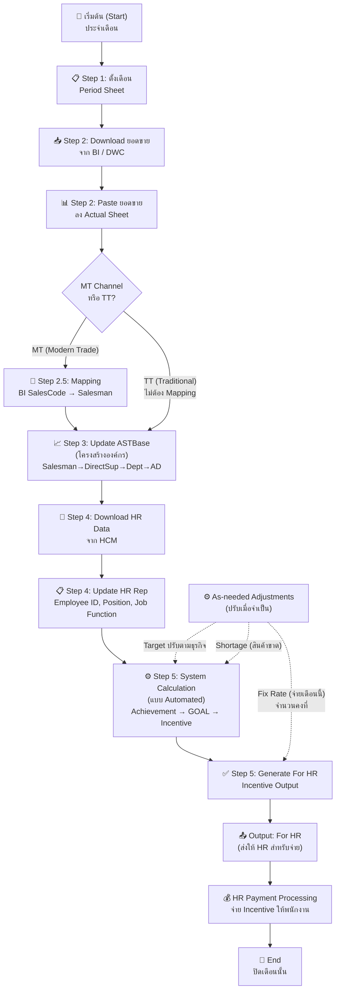

# Sales Incentive System
# Requirement Preparation Document for POC

วันที่: 2026-06-13 | เวอร์ชัน: Draft v0.1

---

## Sale Incentive Guide — ขั้นตอนการทำงานหลัก (Operational Workflow)

### ภาษาไทย

#### รอบประจำปี (Annually)

| ขั้นที่ | Sheet | รายละเอียด |
|--------|-------|------------|
| 1 | M_Month | กำหนดตาราง mapping ระหว่างเดือนยอดขาย กับเดือนจ่าย Incentive แยก Variable และ Fixed ตลอดรอบปี |

#### รอบประจำเดือน (Monthly)

| ขั้นที่ | Sheet | รายละเอียด |
|--------|-------|------------|
| 1 | Period | กำหนดงวดที่ต้องการคำนวณ Sales Incentive |
| 2 | Actual | Download ข้อมูลยอดขายจาก BI แล้ว copy ลง Actual sheet |
| 3 | AST_Base | อัปเดตข้อมูล AST Base sheet และ copy สูตรในคอลัมน์ที่ไฮไลต์สีเหลือง |
| 4 | HR Rep | Download รายงาน Personal Employment (Main & Active)_AST จาก HCM, อัปเดตข้อมูลใน HR Rep และ copy สูตรในคอลัมน์ที่ไฮไลต์สีเหลือง |
| 5 | For HR | กรอก Employee ID จากนั้น copy สูตรทุกคอลัมน์ ยกเว้น Employee ID และ Payment Method |

#### ปรับเมื่อจำเป็น (As needed)

| ขั้นที่ | Sheet | รายละเอียด |
|--------|-------|------------|
| 1 | T_SectAbove | ปรับอัตราค่าตอบแทนตามระดับตำแหน่ง |
| 2 | Table | ปรับอัตราค่าตอบแทนตาม Job Function |
| 3 | Target & Cal | ปรับเป้าหมายการขายตามสภาพธุรกิจ |
| 4 | Shortage | ปรับกรณีสินค้าขาดแคลนรายสินค้า/เดือน |
| 5 | Fix Rate | ปรับอัตราคงที่รายพนักงาน |

> ⚠️ **หมายเหตุสำคัญ:** ต้องตรวจสอบให้แน่ใจว่าข้อมูลยอดขายและข้อมูลพนักงาน **สอดคล้องกับงวด Sales Incentive ของเดือนนั้น** เสมอ
> ⚠️ **Recheck Job Function** ก่อนปิดรอบทุกครั้ง

---

### English

#### Annually

| Step No. | Sheet | Step Detail |
|----------|-------|-------------|
| 1 | M_Month | Define the payment calendar mapping between sales month and payout month for both Variable and Fixed Incentive across the year. |

#### Monthly

| Step No. | Sheet | Step Detail |
|----------|-------|-------------|
| 1 | Period | Define the Sales Incentive period. |
| 2 | Actual | Download data from BI and copy it into the Actual sheet. |
| 3 | AST_Base | Update the data in the AST Base sheet and copy the formulas in the yellow-highlighted columns. |
| 4 | HR Rep | Download Personal Employment (Main & Active)_AST report from HCM, update the data in the HR Rep and copy the formulas in the yellow-highlighted columns. |
| 5 | For HR | Enter the employee ID, then copy all formulas except the Employee ID and Payment Method columns. |

#### As needed

| Step No. | Sheet | Step Detail |
|----------|-------|-------------|
| 1 | T_SectAbove | Adjust the compensation rate based on position level. |
| 2 | Table | Adjust the compensation rate based on Job Function. |
| 3 | Target & Cal | Adjust sales targets based on business conditions. |
| 4 | Shortage | Adjust shortages by product and month. |
| 5 | Fix Rate | Adjust fixed rate based on employee. |

> ⚠️ **Important:** Please ensure that sales and employee data align with the Sales Incentive period for that month.
> ⚠️ **Recheck Job Function** before closing each period.

---

## M_Month Explanation — Payment Calendar Logic

### ภาษาไทย: ความหมายและการใช้งาน

#### M_Month คืออะไร

M_Month คือ master sheet สำหรับกำหนดความสัมพันธ์ระหว่าง "เดือนยอดขาย" กับ "รอบการจ่าย incentive" เพื่อให้ระบบรู้ว่า incentive ของเดือนใดต้องถูกนำไปจ่ายใน payroll เดือนใด โดยแยกเป็น 2 ประเภทคือ

- Variable Incentive: incentive ที่ผันตามผลงานขาย
- Fixed Incentive: incentive อัตราคงที่ตาม Job Function หรือ policy ที่กำหนด

#### โครงสร้างข้อมูลใน M_Month

| คอลัมน์ | ความหมายเชิงธุรกิจ | การใช้งานในระบบ |
|---------|--------------------|------------------|
| sales incentive ของเดือน | เดือนที่ผลงานขายเกิดขึ้นจริง | ใช้เป็น key ต้นทางของรอบคำนวณ |
| รอบการจ่าย Incentive (Variable) | เดือนที่จะจ่าย incentive แบบผันแปร | ใช้กำหนด payment month ของผลคำนวณ variable |
| รอบการจ่าย Incentive (Fixed) | เดือนที่จะจ่าย incentive แบบคงที่ | ใช้กำหนด payment month ของ fixed rate |
| Default column | ลำดับอ้างอิง 1-12 | ใช้ช่วยอ้างอิงสูตรและลำดับรอบในไฟล์ต้นทาง |

#### ตัวอย่างการตีความจากตาราง

| เดือนยอดขาย | Variable Payout | Fixed Payout | คำอธิบาย |
|-------------|-----------------|--------------|----------|
| Apr-26 | Jun-26 | May-26 | ยอดขายเดือน Apr-26 จะจ่าย fixed ก่อนใน May-26 และจ่าย variable ใน Jun-26 |
| May-26 | Jul-26 | Jun-26 | variable ช้ากว่าเดือนขาย 2 เดือน และ fixed ช้ากว่าเดือนขาย 1 เดือน |
| Dec-26 | Feb-27 | Jan-27 | รองรับการข้ามปีของรอบจ่ายโดยอัตโนมัติ |

#### หลักการทางธุรกิจที่ได้จาก M_Month

1. Fixed Incentive จ่ายเร็วกว่า Variable Incentive 1 เดือน
2. Variable Incentive ไม่ได้จ่ายในเดือนเดียวกับยอดขาย แต่เลื่อนไปตามรอบ payroll ที่กำหนด
3. ระบบต้องแยกเดือนคำนวณออกจากเดือนจ่าย เพื่อป้องกันความสับสนระหว่าง Period กับ Payment Month
4. เมื่อมีการ export ข้อมูลไปยัง HR ระบบต้องใช้ M_Month ในการ tag รอบจ่าย ไม่ใช่อ้างอิงจากเดือนยอดขายอย่างเดียว

#### ผลกระทบต่อการออกแบบระบบ

| ประเด็น | ผลกระทบ |
|--------|---------|
| Period setup | ผู้ใช้เลือกเดือนยอดขายที่จะคำนวณ แต่ระบบต้อง lookup เดือนจ่ายจาก M_Month เพิ่ม |
| For HR output | ต้องแสดงหรือเก็บ payment month ของ Variable และ Fixed ให้ถูกต้อง |
| Audit / Traceability | ต้องตรวจสอบย้อนหลังได้ว่า sales month ใดถูกจ่ายใน payroll เดือนใด |
| Year crossing | ต้องรองรับกรณีเช่น Dec-26 ไปจ่าย Jan-27 และ Feb-27 โดยไม่ผิดรอบ |

#### สรุปเชิงระบบ

Flow แบบย่อ:
- Input: Sales Period เช่น Apr-26
- Lookup: M_Month
- Output 1: Fixed Payment Month = May-26
- Output 2: Variable Payment Month = Jun-26

ดังนั้น M_Month ไม่ใช่แค่ตารางตั้งค่ารอบปี แต่เป็น payment calendar logic ที่เชื่อมระหว่างการคำนวณ incentive กับการจ่ายเงินจริงของ HR

### English: Meaning and Usage

#### What is M_Month

M_Month is the master sheet that maps the sales month to the incentive payout month. It tells the system when the result of a given sales period should be paid in payroll, separately for Variable and Fixed Incentive.

#### M_Month Data Structure

| Column | Business Meaning | System Usage |
|--------|------------------|-------------|
| sales incentive month | The month when sales performance occurred | Source key for the calculation period |
| Incentive payment cycle (Variable) | The payroll month for variable incentive | Payment month for variable payout |
| Incentive payment cycle (Fixed) | The payroll month for fixed incentive | Payment month for fixed payout |
| Default column | Sequence 1-12 | Used as a formula/reference order in the source workbook |

#### Example Interpretation

| Sales Month | Variable Payout | Fixed Payout | Explanation |
|------------|-----------------|--------------|-------------|
| Apr-26 | Jun-26 | May-26 | Fixed is paid first, then Variable one month later |
| May-26 | Jul-26 | Jun-26 | Variable is delayed by two months from the sales month |
| Dec-26 | Feb-27 | Jan-27 | Supports year-crossing payroll cycles |

#### Business Rules Derived from M_Month

1. Fixed Incentive is paid one month earlier than Variable Incentive.
2. Variable Incentive is not paid in the same month as the sales period.
3. The system must separate calculation month from payout month.
4. HR export must use M_Month to tag the correct payroll cycle.

#### Design Impact

| Topic | Impact |
|------|--------|
| Period setup | The user selects the sales period, then the system looks up the payout month in M_Month |
| For HR output | Output must contain the correct payment month for Variable and Fixed |
| Audit trail | The system must trace which sales month was paid in which payroll month |
| Year crossing | The logic must support Dec-to-Jan/Feb transitions correctly |

---

## System Architecture & Business Process Diagrams

### ภาษาไทย

#### 1. Business Process Diagram — ลำดับการทำงานรายเดือน

