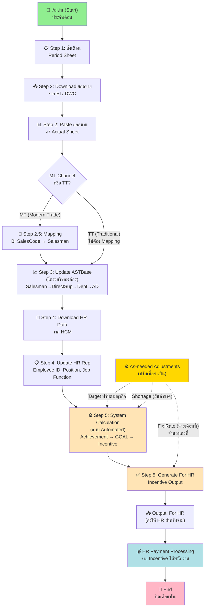
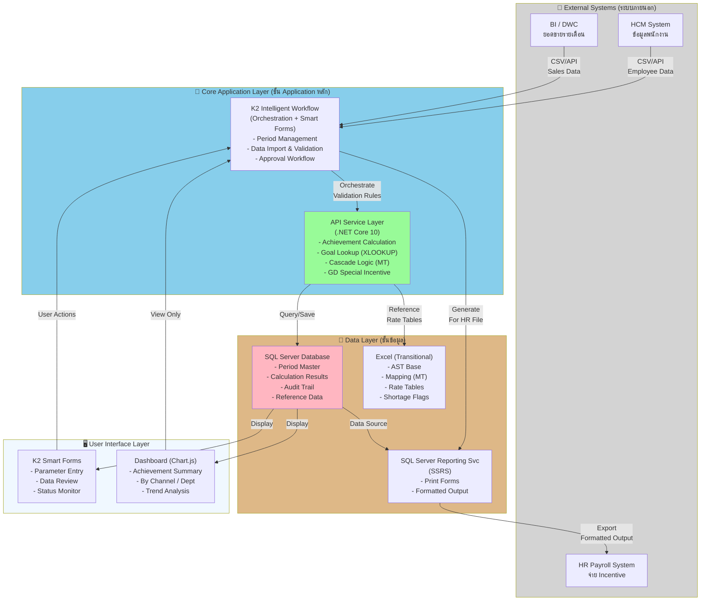
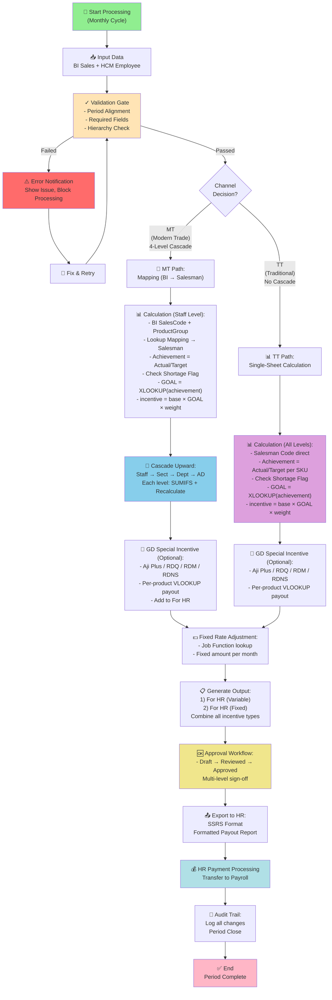
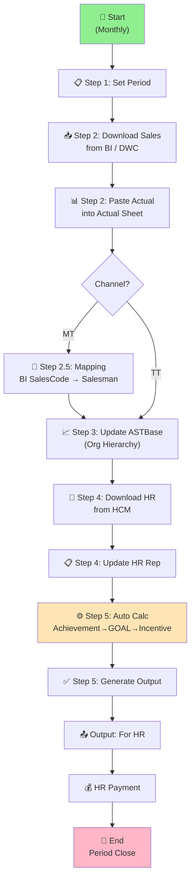
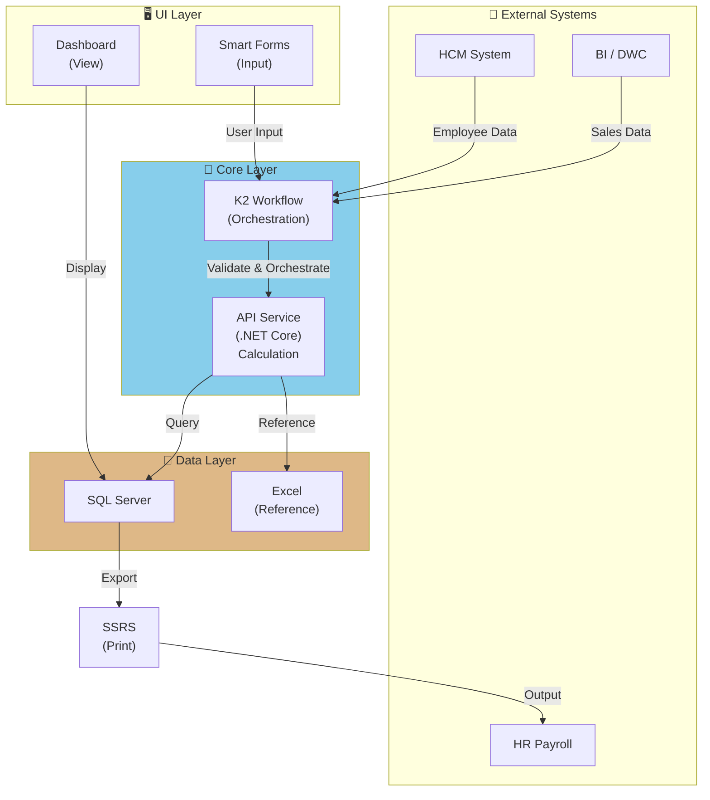
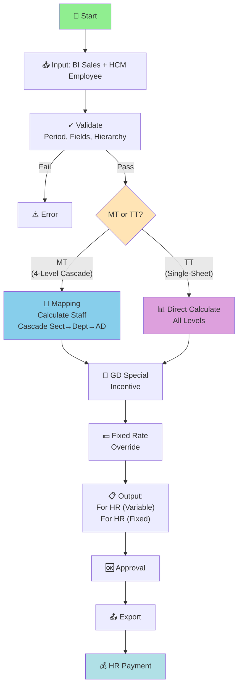

# Sales Incentive System
# Requirement Preparation Document for POC

วันที่: 2026-06-13 | เวอร์ชัน: Draft v0.1

---

## Sale Incentive Guide — ขั้นตอนการทำงานหลัก (Operational Workflow)

### ภาษาไทย

#### รอบประจำปี (Annually)

| ขั้นที่ | Sheet | รายละเอียด |
|--------|-------|------------|
| 1 | M_Month | ตั้งรอบการจ่าย Sales Incentive ปีละ 1 ครั้ง |

#### รอบประจำเดือน (Monthly)

| ขั้นที่ | Sheet | รายละเอียด |
|--------|-------|------------|
| 1 | Period | กำหนดงวดที่ต้องการคำนวณ Sales Incentive |
| 2 | Actual | Download ข้อมูลยอดขายจาก BI แล้ว copy ลง Actual sheet |
| 3 | AST_Base | อัปเดตข้อมูล AST Base sheet และ copy สูตรในคอลัมน์ที่ไฮไลต์สีเหลือง |
| 4 | HR Rep | Download รายงาน Personal Employment (Main & Active)_AST จาก HCM, อัปเดตข้อมูลใน HR Rep และ copy สูตรในคอลัมน์ที่ไฮไลต์สีเหลือง |
| 5 | For HR | กรอก Employee ID จากนั้น copy สูตรทุกคอลัมน์ ยกเว้น Employee ID และ Payment Method |

#### ปรับเมื่อจำเป็น (As needed)

| ขั้นที่ | Sheet | รายละเอียด |
|--------|-------|------------|
| 1 | T_SectAbove | ปรับอัตราค่าตอบแทนตามระดับตำแหน่ง |
| 2 | Table | ปรับอัตราค่าตอบแทนตาม Job Function |
| 3 | Target & Cal | ปรับเป้าหมายการขายตามสภาพธุรกิจ |
| 4 | Shortage | ปรับกรณีสินค้าขาดแคลนรายสินค้า/เดือน |
| 5 | Fix Rate | ปรับอัตราคงที่รายพนักงาน |

> ⚠️ **หมายเหตุสำคัญ:** ต้องตรวจสอบให้แน่ใจว่าข้อมูลยอดขายและข้อมูลพนักงาน **สอดคล้องกับงวด Sales Incentive ของเดือนนั้น** เสมอ
> ⚠️ **Recheck Job Function** ก่อนปิดรอบทุกครั้ง

---

### English

#### Annually

| Step No. | Sheet | Step Detail |
|----------|-------|-------------|
| 1 | M_Month | Set the Sales Incentive payment cycle to once per year. |

#### Monthly

| Step No. | Sheet | Step Detail |
|----------|-------|-------------|
| 1 | Period | Define the Sales Incentive period. |
| 2 | Actual | Download data from BI and copy it into the Actual sheet. |
| 3 | AST_Base | Update the data in the AST Base sheet and copy the formulas in the yellow-highlighted columns. |
| 4 | HR Rep | Download Personal Employment (Main & Active)_AST report from HCM, update the data in the HR Rep and copy the formulas in the yellow-highlighted columns. |
| 5 | For HR | Enter the employee ID, then copy all formulas except the Employee ID and Payment Method columns. |

#### As needed

| Step No. | Sheet | Step Detail |
|----------|-------|-------------|
| 1 | T_SectAbove | Adjust the compensation rate based on position level. |
| 2 | Table | Adjust the compensation rate based on Job Function. |
| 3 | Target & Cal | Adjust sales targets based on business conditions. |
| 4 | Shortage | Adjust shortages by product and month. |
| 5 | Fix Rate | Adjust fixed rate based on employee. |

> ⚠️ **Important:** Please ensure that sales and employee data align with the Sales Incentive period for that month.
> ⚠️ **Recheck Job Function** before closing each period.

---

## System Architecture & Business Process Diagrams

### ภาษาไทย

#### 1. Business Process Diagram — ลำดับการทำงานรายเดือน

**ขั้นตอน:**
- **Monthly:** ทำซ้ำทุกเดือน — Period → Actual → ASTBase → HR Rep → For HR → Payment
- **As-needed:** ปรับพารามิเตอร์เมื่อจำเป็น (Target, Shortage, Fix Rate)

#### 2. System Architecture Diagram — โครงสร้างระบบ

**Components:**
- **External:** BI, HCM ส่งข้อมูล
- **Core:** K2 Workflow (orchestration) + API (.NET calculation)
- **Data:** SQL Server (results) + Excel (transitional reference)
- **UI:** Smart Forms + Dashboard
- **Output:** SSRS → HR System

#### 3. System Flow Diagram — MT vs TT Channel Processing

**Key Differences:**
- **MT:** Mapping + 4-level Cascade + Product Group basis
- **TT:** No Mapping + Single-sheet + SKU basis
- **GD:** Optional special incentive (both channels)
- **Fixed Rate:** Manual override per Job Function

---

### English

#### 1. Business Process Flow — Monthly Workflow

#### 2. System Architecture — Components

#### 3. Processing Flow — MT vs TT

---

## Function 1 — Sales Data Management

### ภาษาไทย

### 1.1 Datasource

| แหล่งข้อมูล | ระบบต้นทาง | ประเภทข้อมูล | ความถี่ |
|------------|-----------|------------|--------|
| ยอดขาย (Actual Sales) | BI / DWC (Data Warehouse Cloud) | ยอดขายรายเดือน ราย Salesman / Product Group / SKU | รายเดือน |
| ข้อมูลพนักงาน (Employee) | HCM (Human Capital Management) | Employee ID, ชื่อ, ตำแหน่ง, Job Function, Grade, Cost Center | รายเดือน |
| โครงสร้างองค์กร | ASTBase (ในไฟล์ Excel) | Salesman → DirectSup → DeptMgr → DivMgr | รายเดือน |

**หมายเหตุ:**
- MT: BI ส่งข้อมูล BI SalesCode + Product Group → ต้องผ่าน Mapping sheet ก่อน เพื่อแปลงเป็น Salesman Code
- TT: BI ส่ง Salesman Code ตรง → ไม่ต้องผ่าน Mapping
- ข้อมูลทั้งหมดต้องอยู่ใน period เดียวกัน (ตาม Period sheet)

### 1.2 Data Validation & Error Handling

| รายการตรวจ | เงื่อนไข | Action เมื่อพบปัญหา |
|-----------|---------|--------------------|
| Period alignment | Sales data และ HR data ต้องเป็นเดือนเดียวกับ Period | Reject และแจ้ง error |
| Required fields | Salesman Code, Product Code, Employee ID ต้องไม่ว่าง | Reject แถวที่ขาดข้อมูล |
| Key uniqueness | Salesman + Product ต้องไม่ซ้ำใน period เดียวกัน | Deduplicate หรือ alert |
| Hierarchy consistency | DirectSupCode ต้องมีอยู่จริงใน ASTBase | Alert และ block cascade |
| Job Function | ต้องตรงกับตารางอัตราที่กำหนด | Alert ให้ recheck |

### English

### 1.1 Datasource

| Source | System | Data Type | Frequency |
|--------|--------|-----------|----------|
| Sales Actual | BI / DWC | Monthly sales by Salesman / Product Group / SKU | Monthly |
| Employee Data | HCM | Employee ID, Name, Position, Job Function, Grade, Cost Center | Monthly |
| Org Hierarchy | ASTBase | Salesman → DirectSup → DeptMgr → DivMgr | Monthly |

### 1.2 Data Validation & Error Handling

| Check | Condition | Action on Failure |
|-------|-----------|------------------|
| Period alignment | Sales and HR data must match the incentive period | Reject and notify |
| Required fields | Salesman Code, Product Code, Employee ID must not be empty | Reject affected rows |
| Key uniqueness | Salesman + Product must be unique per period | Deduplicate or alert |
| Hierarchy consistency | DirectSupCode must exist in ASTBase | Alert and block cascade |
| Job Function | Must match the compensation rate table | Alert for recheck |
