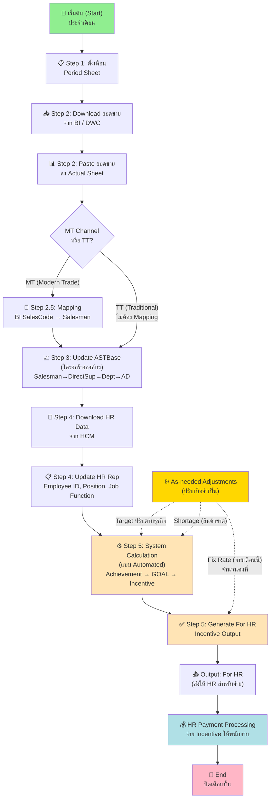
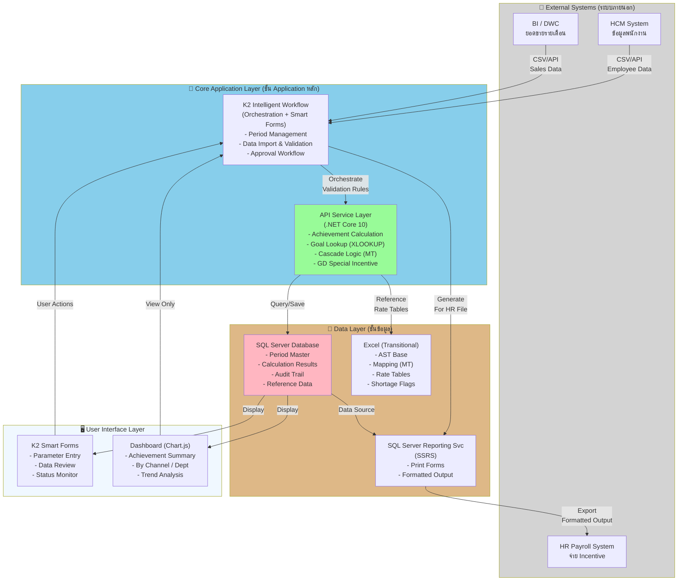
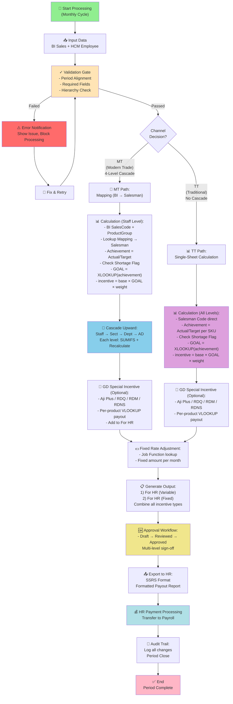
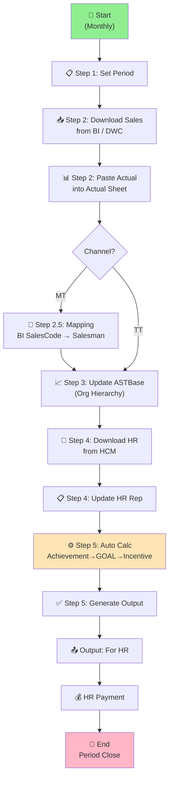
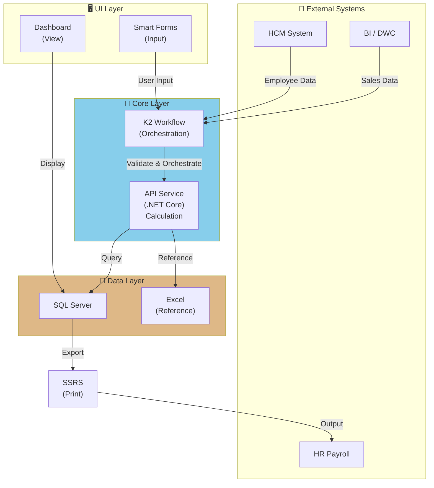
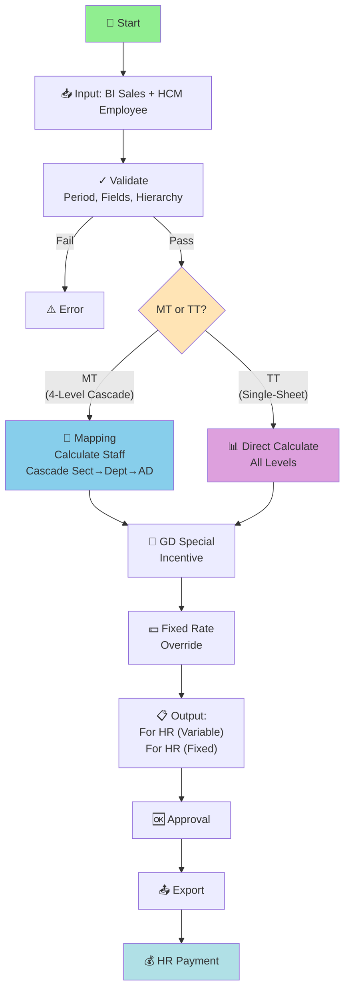

# Sales Incentive System - Requirement Preparation Document for POC

วันที่: 2026-06-13 | เวอร์ชัน: Draft v0.1

---

## Sale Incentive Guide — ขั้นตอนการทำงานหลัก (Operational Workflow)

ภาษาไทย

### รอบประจำปี (Annually)

| ขั้นที่ | Sheet | รายละเอียด |
| --- | --- | --- |
| 1 | M_Month | กำหนดตาราง mapping ระหว่างเดือนยอดขาย กับเดือนจ่าย Incentive แยก Variable และ Fixed ตลอดรอบปี |

### รอบประจำเดือน (Monthly)

| ขั้นที่ | Sheet | รายละเอียด |
| --- | --- | --- |
| 1 | Period | กำหนดงวดที่ต้องการคำนวณ Sales Incentive |
| 2 | Actual | Download ข้อมูลยอดขายจาก BI แล้ว copy ลง Actual sheet |
| 3 | AST_Base | อัปเดตข้อมูล AST Base sheet และ copy สูตรในคอลัมน์ที่ไฮไลต์สีเหลือง |
| 4 | HR Rep | Download รายงาน Personal Employment (Main & Active)_AST จาก HCM, อัปเดตข้อมูลใน HR Rep และ copy สูตรในคอลัมน์ที่ไฮไลต์สีเหลือง |
| 5 | For HR | กรอก Employee ID จากนั้น copy สูตรทุกคอลัมน์ ยกเว้น Employee ID และ Payment Method |

### ปรับเมื่อจำเป็น (As needed)

| ขั้นที่ | Sheet | รายละเอียด |
| --- | --- | --- |
| 1 | T_SectAbove | ปรับอัตราค่าตอบแทนตามระดับตำแหน่ง |
| 2 | Table | ปรับอัตราค่าตอบแทนตาม Job Function |
| 3 | Target & Cal | ปรับเป้าหมายการขายตามสภาพธุรกิจ |
| 4 | Shortage | ปรับกรณีสินค้าขาดแคลนรายสินค้า/เดือน |
| 5 | Fix Rate | ปรับอัตราคงที่รายพนักงาน |

> ⚠️ **หมายเหตุสำคัญ:** ต้องตรวจสอบให้แน่ใจว่าข้อมูลยอดขายและข้อมูลพนักงาน **สอดคล้องกับงวด Sales Incentive ของเดือนนั้น** เสมอ
> ⚠️ **Recheck Job Function** ก่อนปิดรอบทุกครั้ง

---

English

### Annually

| Step No. | Sheet | Step Detail |
| --- | --- | --- |
| 1 | M_Month | Define the payment calendar mapping between sales month and payout month for both Variable and Fixed Incentive across the year. |

### Monthly

| Step No. | Sheet | Step Detail |
| --- | --- | --- |
| 1 | Period | Define the Sales Incentive period. |
| 2 | Actual | Download data from BI and copy it into the Actual sheet. |
| 3 | AST_Base | Update the data in the AST Base sheet and copy the formulas in the yellow-highlighted columns. |
| 4 | HR Rep | Download Personal Employment (Main & Active)_AST report from HCM, update the data in the HR Rep and copy the formulas in the yellow-highlighted columns. |
| 5 | For HR | Enter the employee ID, then copy all formulas except the Employee ID and Payment Method columns. |

### As needed

| Step No. | Sheet | Step Detail |
| --- | --- | --- |
| 1 | T_SectAbove | Adjust the compensation rate based on position level. |
| 2 | Table | Adjust the compensation rate based on Job Function. |
| 3 | Target & Cal | Adjust sales targets based on business conditions. |
| 4 | Shortage | Adjust shortages by product and month. |
| 5 | Fix Rate | Adjust fixed rate based on employee. |

> ⚠️ **Important:** Please ensure that sales and employee data align with the Sales Incentive period for that month.
> ⚠️ **Recheck Job Function** before closing each period.

---

## M_Month Explanation — Payment Calendar Logic

### ภาษาไทย: ความหมายและการใช้งาน

#### M_Month คืออะไร

M_Month คือ master sheet สำหรับกำหนดความสัมพันธ์ระหว่าง "เดือนยอดขาย" กับ "รอบการจ่าย incentive" เพื่อให้ระบบรู้ว่า incentive ของเดือนใดต้องถูกนำไปจ่ายใน payroll เดือนใด โดยแยกเป็น 2 ประเภทคือ

- Variable Incentive: incentive ที่ผันตามผลงานขาย
- Fixed Incentive: incentive อัตราคงที่ตาม Job Function หรือ policy ที่กำหนด

#### โครงสร้างข้อมูลใน M_Month

| คอลัมน์ | ความหมายเชิงธุรกิจ | การใช้งานในระบบ |
| --- | --- | --- |
| sales incentive ของเดือน | เดือนที่ผลงานขายเกิดขึ้นจริง | ใช้เป็น key ต้นทางของรอบคำนวณ |
| รอบการจ่าย Incentive (Variable) | เดือนที่จะจ่าย incentive แบบผันแปร | ใช้กำหนด payment month ของผลคำนวณ variable |
| รอบการจ่าย Incentive (Fixed) | เดือนที่จะจ่าย incentive แบบคงที่ | ใช้กำหนด payment month ของ fixed rate |
| Default column | ลำดับอ้างอิง 1-12 | ใช้ช่วยอ้างอิงสูตรและลำดับรอบในไฟล์ต้นทาง |

#### ตัวอย่างการตีความจากตาราง

| เดือนยอดขาย | Variable Payout | Fixed Payout | คำอธิบาย |
| --- | --- | --- | --- |
| Apr-26 | Jun-26 | May-26 | ยอดขายเดือน Apr-26 จะจ่าย fixed ก่อนใน May-26 และจ่าย variable ใน Jun-26 |
| May-26 | Jul-26 | Jun-26 | variable ช้ากว่าเดือนขาย 2 เดือน และ fixed ช้ากว่าเดือนขาย 1 เดือน |
| Dec-26 | Feb-27 | Jan-27 | รองรับการข้ามปีของรอบจ่ายโดยอัตโนมัติ |

#### หลักการทางธุรกิจที่ได้จาก M_Month

1. Fixed Incentive จ่ายเร็วกว่า Variable Incentive 1 เดือน
2. Variable Incentive ไม่ได้จ่ายในเดือนเดียวกับยอดขาย แต่เลื่อนไปตามรอบ payroll ที่กำหนด
3. ระบบต้องแยกเดือนคำนวณออกจากเดือนจ่าย เพื่อป้องกันความสับสนระหว่าง Period กับ Payment Month
4. เมื่อมีการ export ข้อมูลไปยัง HR ระบบต้องใช้ M_Month ในการ tag รอบจ่าย ไม่ใช่อ้างอิงจากเดือนยอดขายอย่างเดียว

#### ผลกระทบต่อการออกแบบระบบ

| ประเด็น | ผลกระทบ |
| --- | --- |
| Period setup | ผู้ใช้เลือกเดือนยอดขายที่จะคำนวณ แต่ระบบต้อง lookup เดือนจ่ายจาก M_Month เพิ่ม |
| For HR output | ต้องแสดงหรือเก็บ payment month ของ Variable และ Fixed ให้ถูกต้อง |
| Audit / Traceability | ต้องตรวจสอบย้อนหลังได้ว่า sales month ใดถูกจ่ายใน payroll เดือนใด |
| Year crossing | ต้องรองรับกรณีเช่น Dec-26 ไปจ่าย Jan-27 และ Feb-27 โดยไม่ผิดรอบ |

#### สรุปเชิงระบบ

Flow แบบย่อ:

- Input: Sales Period เช่น Apr-26
- Lookup: M_Month
- Output 1: Fixed Payment Month = May-26
- Output 2: Variable Payment Month = Jun-26

ดังนั้น M_Month ไม่ใช่แค่ตารางตั้งค่ารอบปี แต่เป็น payment calendar logic ที่เชื่อมระหว่างการคำนวณ incentive กับการจ่ายเงินจริงของ HR

### English: Meaning and Usage

#### What is M_Month

M_Month is the master sheet that maps the sales month to the incentive payout month. It tells the system when the result of a given sales period should be paid in payroll, separately for Variable and Fixed Incentive.

#### M_Month Data Structure

| Column | Business Meaning | System Usage |
| --- | --- | --- |
| sales incentive month | The month when sales performance occurred | Source key for the calculation period |
| Incentive payment cycle (Variable) | The payroll month for variable incentive | Payment month for variable payout |
| Incentive payment cycle (Fixed) | The payroll month for fixed incentive | Payment month for fixed payout |
| Default column | Sequence 1-12 | Used as a formula/reference order in the source workbook |

#### Example Interpretation

| Sales Month | Variable Payout | Fixed Payout | Explanation |
| --- | --- | --- | --- |
| Apr-26 | Jun-26 | May-26 | Fixed is paid first, then Variable one month later |
| May-26 | Jul-26 | Jun-26 | Variable is delayed by two months from the sales month |
| Dec-26 | Feb-27 | Jan-27 | Supports year-crossing payroll cycles |

#### Business Rules Derived from M_Month

1. Fixed Incentive is paid one month earlier than Variable Incentive.
2. Variable Incentive is not paid in the same month as the sales period.
3. The system must separate calculation month from payout month.
4. HR export must use M_Month to tag the correct payroll cycle.

#### Design Impact

| Topic | Impact |
| --- | --- |
| Period setup | The user selects the sales period, then the system looks up the payout month in M_Month |
| For HR output | Output must contain the correct payment month for Variable and Fixed |
| Audit trail | The system must trace which sales month was paid in which payroll month |
| Year crossing | The logic must support Dec-to-Jan/Feb transitions correctly |

---

## System Architecture & Business Process Diagrams

ภาษาไทย

### 1. Business Process Diagram — ลำดับการทำงานรายเดือน

**ขั้นตอน:**

- **Monthly:** ทำซ้ำทุกเดือน — Period → Actual → ASTBase → HR Rep → For HR → Payment
- **As-needed:** ปรับพารามิเตอร์เมื่อจำเป็น (Target, Shortage, Fix Rate)

### 2. System Architecture Diagram — โครงสร้างระบบ

**Components:**

- **External:** BI, HCM ส่งข้อมูล
- **Core:** K2 Workflow (orchestration) + API (.NET calculation)
- **Data:** SQL Server (results) + Excel (transitional reference)
- **UI:** Smart Forms + Dashboard
- **Output:** SSRS → HR System

### 3. System Flow Diagram — MT vs TT Channel Processing

**Key Differences:**

- **MT:** Mapping + 4-level Cascade + Product Group basis
- **TT:** No Mapping + Single-sheet + SKU basis
- **GD:** Optional special incentive (both channels)
- **Fixed Rate:** Manual override per Job Function

---

English

### 1. Business Process Flow — Monthly Workflow

### 2. System Architecture — Components

### 3. Processing Flow — MT vs TT

---

## Function 1 — Sales Data Management

ภาษาไทย

### 1.1 Datasource (ภาษาไทย)

| แหล่งข้อมูล | ระบบต้นทาง | ประเภทข้อมูล | ความถี่ |
| --- | --- | --- | --- |
| ยอดขาย (Actual Sales) | BI / DWC (Data Warehouse Cloud) | ยอดขายรายเดือน ราย Salesman / Product Group / SKU | รายเดือน |
| ข้อมูลพนักงาน (Employee) | HCM (Human Capital Management) | Employee ID, ชื่อ, ตำแหน่ง, Job Function, Grade, Cost Center | รายเดือน |
| โครงสร้างองค์กร | ASTBase (ในไฟล์ Excel) | Salesman → DirectSup → DeptMgr → DivMgr | รายเดือน |

**หมายเหตุ:**

- MT: BI ส่งข้อมูล BI SalesCode + Product Group → ต้องผ่าน Mapping sheet ก่อน เพื่อแปลงเป็น Salesman Code
- TT: BI ส่ง Salesman Code ตรง → ไม่ต้องผ่าน Mapping
- ข้อมูลทั้งหมดต้องอยู่ใน period เดียวกัน (ตาม Period sheet)

### 1.2 Data Validation & Error Handling (English)

| รายการตรวจ | เงื่อนไข | Action เมื่อพบปัญหา |
| --- | --- | --- |
| Period alignment | Sales data และ HR data ต้องเป็นเดือนเดียวกับ Period | Reject และแจ้ง error |
| Required fields | Salesman Code, Product Code, Employee ID ต้องไม่ว่าง | Reject แถวที่ขาดข้อมูล |
| Key uniqueness | Salesman + Product ต้องไม่ซ้ำใน period เดียวกัน | Deduplicate หรือ alert |
| Hierarchy consistency | DirectSupCode ต้องมีอยู่จริงใน ASTBase | Alert และ block cascade |
| Job Function | ต้องตรงกับตารางอัตราที่กำหนด | Alert ให้ recheck |

English

### 1.1 Datasource (English)

| Source | System | Data Type | Frequency |
| --- | --- | --- | --- |
| Sales Actual | BI / DWC | Monthly sales by Salesman / Product Group / SKU | Monthly |
| Employee Data | HCM | Employee ID, Name, Position, Job Function, Grade, Cost Center | Monthly |
| Org Hierarchy | ASTBase | Salesman → DirectSup → DeptMgr → DivMgr | Monthly |

### 1.2 Data Validation & Error Handling

| Check | Condition | Action on Failure |
| --- | --- | --- |
| Period alignment | Sales and HR data must match the incentive period | Reject and notify |
| Required fields | Salesman Code, Product Code, Employee ID must not be empty | Reject affected rows |
| Key uniqueness | Salesman + Product must be unique per period | Deduplicate or alert |
| Hierarchy consistency | DirectSupCode must exist in ASTBase | Alert and block cascade |
| Job Function | Must match the compensation rate table | Alert for recheck |

---

## Function 2 — Sales Target

ภาษาไทย

### 2.1 กรณี Target ยังไม่มีในระบบ

| กรณี | การจัดการ |
| --- | --- |
| Target = 0 หรือ null | สูตรใช้ IFERROR → คืนค่า 0 (ไม่คำนวณ achievement) |
| Target มีค่าแต่ Actual = 0 | achievement = 0 → ได้รับ incentive ขั้นต่ำตาม floor policy |
| Shortage flag ตรง product+month | บังคับ achievement = 1.0 (100%) โดยไม่คำนึงถึง Actual จริง |
| Target ถูกปรับระหว่างปี | แก้ไขผ่าน Target & Cal sheet (As needed) พร้อมบันทึกเหตุผล |

**หลักการปัจจุบัน (As-Is):** กรอก Target ลงใน Target & Cal sheet โดยตรง (manual)
**หลักการเป้าหมาย (To-Be):** นำเข้า Target จากระบบ หรือ approve ผ่าน workflow ก่อน lock

English

### 2.1 When Target is Not Available in the System

| Case | Handling |
| --- | --- |
| Target = 0 or null | Formula uses IFERROR → returns 0 (no achievement calculated) |
| Target exists but Actual = 0 | achievement = 0 → receives minimum incentive based on floor policy |
| Shortage flag for product+month | Force achievement = 1.0 (100%) regardless of actual sales |
| Target adjusted mid-year | Edit via Target & Cal sheet (As needed) with reason recorded |

---

## Function 3 — Incentive Calculation

ภาษาไทย

### 3.1 Calculation Hierarchy by Channel (ภาษาไทย)

#### TT Channel & Laos Channel (ภาษาไทย)

**หลักการ:** คิดตาม SKU/Product ราย Salesman — Target & Cal รวมอยู่ใน 1 sheet

| ขั้นตอน | รายละเอียด |
| --- | --- |
| 1 | achievement = ROUND(Actual / Target, 4) ราย product ราย salesman รายเดือน |
| 2 | ถ้า Shortage flag → achievement = 1.0 |
| 3 | GOAL = XLOOKUP(achievement, threshold, goal table, step-down) |
| 4 | incentive ราย product = base × GOAL × weight |
| 5 | For HR รวม incentive ทุก product ราย salesman และทุกระดับ (Direct Sup, Dept Mgr, Div Mgr, AD) |
| 6 | Laos Dept คำนวณแยกในคอลัมน์พิเศษใน For HR (AD) |

#### MT Channel & S&I Channel (ภาษาไทย)

**หลักการ:** คิดตาม Product Group — 1 บัญชี BI แบ่งให้ Salesman หลายคนตาม product group ผ่าน Mapping sheet — มี Cascade 4 ระดับ

| ขั้นตอน | รายละเอียด |
| --- | --- |
| 1 | Mapping: BI SalesCode + Product Group → Salesman Code |
| 2 | achievement = ROUND(Actual / Target, 4) ราย product group |
| 3 | ถ้า Shortage flag → achievement = 1.0 |
| 4 | GOAL = XLOOKUP(achievement, threshold, goal table, step-down) |
| 5 | incentive ราย product group = base × GOAL × weight |
| 6 | **Cascade:** SUMIFS Target+Actual จาก Staff → Sect → Dept → AD แล้วคำนวณ achievement+incentive ใหม่ทุกระดับ |
| 7 | For HR = MAX(floor, Σ incentive ทุกระดับ Staff+Sect+Dept+AD) |

**GOAL Table (Achievement → Multiplier):**

| Achievement ≥ | 90% | 95% | 100% | 103% | 106% | 110% | 115% | 120% | 130% |
| --- | --- | --- | --- | --- | --- | --- | --- | --- | --- |
| Multiplier | 0.90 | 0.95 | 1.00 | 1.03 | 1.06 | 1.10 | 1.15 | 1.20 | 1.30 |

### 3.2 Prorate Logic (ภาษาไทย)

| กรณี | การจัดการ |
| --- | --- |
| พนักงานเข้างาน/ออกงานกลางเดือน | ❓ ยังรอยืนยัน policy จาก Business |
| Shortage override | บังคับ achievement = 1.0 ไม่คำนึงถึงสัดส่วนเวลา |
| Fix Rate | จ่ายเต็มจำนวนตาม Job Function ไม่มี prorate ในสูตรปัจจุบัน |

English

### 3.1 Calculation Hierarchy by Channel (English)

#### TT Channel & Laos Channel (English)

**Principle:** Per SKU/Product per Salesman — single Target & Cal sheet covers all levels

| Step | Detail |
| --- | --- |
| 1 | achievement = ROUND(Actual / Target, 4) per product per salesman per month |
| 2 | If Shortage flag → achievement = 1.0 |
| 3 | GOAL = XLOOKUP(achievement, threshold, goal table, step-down mode) |
| 4 | incentive per product = base × GOAL × weight |
| 5 | For HR aggregates incentive across all products per salesman and all levels (Direct Sup, Dept Mgr, Div Mgr, AD) |
| 6 | Laos Dept calculated separately in special column in For HR (AD) |

#### MT Channel & S&I Channel (English)

**Principle:** Per Product Group — 1 BI account split to multiple Salesmen by product group via Mapping sheet — 4-level Cascade

| Step | Detail |
| --- | --- |
| 1 | Mapping: BI SalesCode + Product Group → Salesman Code |
| 2 | achievement = ROUND(Actual / Target, 4) per product group |
| 3 | If Shortage flag → achievement = 1.0 |
| 4 | GOAL = XLOOKUP(achievement, threshold, goal table, step-down mode) |
| 5 | incentive per product group = base × GOAL × weight |
| 6 | **Cascade:** SUMIFS Target+Actual from Staff → Sect → Dept → AD, then recalculate achievement+incentive fresh at each level |
| 7 | For HR = MAX(floor, Σ incentive all levels Staff+Sect+Dept+AD) |

### 3.2 Prorate Logic (English)

| Case | Handling |
| --- | --- |
| Employee joins/leaves mid-month | ❓ Pending Business policy confirmation |
| Shortage override | Force achievement = 1.0 regardless of time proportion |
| Fix Rate | Full amount paid by Job Function, no prorate in current formula |

---

## Function 4 — Special Adjustment

ภาษาไทย

### 4.1 ประเภทของ Special Adjustment

| ประเภท | Sheet | เงื่อนไขใช้งาน | ผลกระทบ |
| --- | --- | --- | --- |
| T_SectAbove | T_SectAbove | ปรับอัตราตามระดับตำแหน่ง | เปลี่ยน incentive base ของตำแหน่งนั้น |
| Table (Job Function Rate) | Table | ปรับอัตราตาม Job Function | เปลี่ยน weight/base ราย salesman |
| Target Adjustment | Target & Cal | ปรับ Target ตามสถานการณ์ธุรกิจ | เปลี่ยน achievement โดยตรง |
| Shortage Override | Shortage | สินค้าขาดตลาด product+month ที่ระบุ | บังคับ achievement = 1.0 |
| Fix Rate | ค่าตอบแทนการขายในอัตราคงที่ | ตาม Job Function ที่กำหนด | จ่ายจำนวนเงินคงที่โดยไม่ขึ้นกับ achievement |
| Special Product Incentive (GD) | Aji Plus / RDQ / RDM / RDNS | สินค้ากลุ่ม Growth Driver G2 | คำนวณ incentive แยก scheme ราย product |

**Fix Rate ปัจจุบัน (ยืนยันแล้ว):**

| Job Function | อัตราคงที่ (บาท/เดือน) |
| --- | --- |
| TT Senior Cash Van Sales | 3,000 |
| TT Senior Cash Van Food Vendor | 3,000 |
| TT Cash Van Sales | 2,500 |
| TT Cash Van Food Vendor | 2,500 |
| Shop Front | 1,500 |
| Sales Assistant | 1,200 |

**Special Product Incentive — GD Scheme (ยืนยันบางส่วน):**

- achievement = ROUND(Actual ÷ Target, 4) ราย product GD รายเดือน
- payout = VLOOKUP(achievement, ตาราง GD) คืนจำนวนเงินตามขั้น (step)
- รวมรายปี = SUM payout 12 เดือน
- ❓ วิธีนำไปจ่าย (รวม For HR หรือแยก) ยังรอยืนยัน

English

### 4.1 Types of Special Adjustment

| Type | Sheet | When to Use | Impact |
| --- | --- | --- | --- |
| T_SectAbove | T_SectAbove | Adjust rate by position level | Changes incentive base for that position |
| Table (Job Function Rate) | Table | Adjust rate by Job Function | Changes weight/base per salesman |
| Target Adjustment | Target & Cal | Adjust target due to business conditions | Directly changes achievement |
| Shortage Override | Shortage | Out-of-stock product+month combination | Forces achievement = 1.0 |
| Fix Rate | Fix Rate sheet | By designated Job Function | Pays fixed amount regardless of achievement |
| Special Product Incentive (GD) | Aji Plus / RDQ / RDM / RDNS | Growth Driver G2 products | Separate incentive scheme per product |

---

## Test Cases สำหรับ POC / Demo

ภาษาไทย

| TC | ชื่อ Test Case | Channel | เงื่อนไข | ผลที่คาดหวัง |
| --- | --- | --- | --- | --- |
| TC-001 | Normal calculation TT | TT | Actual = 100% of Target, ไม่มี Shortage | achievement = 1.0, incentive = base × 1.00 × weight |
| TC-002 | Below threshold TT | TT | Actual = 85% of Target | achievement = 0.85, ต่ำกว่า floor → incentive = floor (0.90 rate) |
| TC-003 | Shortage override TT | TT | Product A เดือน Apr ถูก flag Shortage | achievement = 1.0 แม้ Actual < Target |
| TC-004 | Normal calculation MT | MT | Actual = 106% ของ Target | achievement = 1.06 → GOAL = 1.06 |
| TC-005 | MT Cascade Staff→Sect | MT | Section Manager ดูแล 3 Salesman | Sect target = SUMIFS ทั้ง 3 คน, คำนวณ incentive ใหม่ที่ระดับ Sect |
| TC-006 | Fix Rate | MT/TT | Job Function = TT Cash Van Sales | จ่าย 2,500 บาท คงที่ ไม่ขึ้นกับ achievement |
| TC-007 | Period mismatch | MT | Sales data เป็นเดือน May แต่ Period ตั้งเป็น Apr | ระบบต้อง reject และแจ้ง error |
| TC-008 | GD — Aji Plus | MT/TT | Salesman มียอด Aji Plus 115% ของ Target | GD payout ตามขั้นที่ 115% |

English

| TC | Test Case Name | Channel | Condition | Expected Result |
| --- | --- | --- | --- | --- |
| TC-001 | Normal calculation TT | TT | Actual = 100% of Target, no Shortage | achievement = 1.0, incentive = base × 1.00 × weight |
| TC-002 | Below threshold TT | TT | Actual = 85% of Target | achievement = 0.85, below floor → incentive at 0.90 rate |
| TC-003 | Shortage override TT | TT | Product A in Apr flagged as Shortage | achievement = 1.0 even if Actual < Target |
| TC-004 | Normal calculation MT | MT | Actual = 106% of Target | achievement = 1.06 → GOAL = 1.06 |
| TC-005 | MT Cascade Staff→Sect | MT | Section Manager supervises 3 Salesmen | Sect target = SUMIFS of all 3, recalculate incentive fresh at Sect level |
| TC-006 | Fix Rate | MT/TT | Job Function = TT Cash Van Sales | Pay fixed 2,500 THB regardless of achievement |
| TC-007 | Period mismatch | MT | Sales data is May but Period set to Apr | System must reject and notify error |
| TC-008 | GD — Aji Plus | MT/TT | Salesman achieves 115% of Aji Plus target | GD payout at the 115% step |

---

## Project Scope Assessment สำหรับการประเมิน Manday

ภาษาไทย

### 1. ขอบเขตการพัฒนา (Development Scope)

| ฟังก์ชัน | ระบบย่อย | ปริมาณ | ความซับซ้อน | หมายเหตุ |
| --- | --- | --- | --- | --- |
| **Import Data** | Import BI/DWC | 1 | ต่ำ | API call + CSV parse |
| | Import HCM | 1 | ต่ำ | API call + mapping employee |
| | Import ASTBase | 1 | ต่ำ | Manual upload หรือ sync |
| **Validation** | Period alignment check | 1 | ปานกลาง | Business rule enforcement |
| | Required fields check | 1 | ต่ำ | Standard validation |
| | Hierarchy consistency | 1 | ปานกลาง | Recursive hierarchy validation |
| **Calculation (MT)** | Staff level calc | 1 | สูง | SUMIFS + Cascade logic |
| | Sect level cascade | 1 | สูง | Recalculate from Staff |
| | Dept level cascade | 1 | สูง | Recalculate from Sect |
| | AD level cascade | 1 | สูง | Recalculate from Dept |
| **Calculation (TT)** | Single-sheet calculation | 1 | ปานกลาง | Simpler than MT cascade |
| **Calculation (GD)** | Special Product (4 products) | 4 | ปานกลาง | VLOOKUP payout table per product |
| **Output** | Variable Incentive export | 1 | ต่ำ | Format to HR template |
| | Fixed Rate export | 1 | ต่ำ | Map Job Function → fixed amount |
| | Audit Trail logging | 1 | ปานกลาง | Track parameter changes + approvals |
| **Parameters** | Period setup | 1 | ต่ำ | Date range entry |
| | Target management | 1 | ต่ำ | CRUD operations |
| | Shortage adjustment | 1 | ต่ำ | Flag product+month |
| | Fix Rate adjustment | 1 | ต่ำ | Override by Job Function |
| | Compensation rate (T_SectAbove, Table) | 1 | ต่ำ | Master data maintenance |
| **Approval & Workflow** | Status management | 1 | ปานกลาง | Draft→Calculated→Reviewed→Approved→Exported |
| | Multi-level approval | 1 | สูง | Business Owner + HR sign-off |
| **Reporting & UI** | Dashboard overview | 1 | ปานกลาง | Chart.js summary |
| | Calculation trace report | 1 | ปานกลาง | Detail breakdown per person |
| | SSRS print form | 1 | ปานกลาง | Formatted payout sheet |
| **Total Items** | | **26** | | |

### 2. ช่องทางขาย (Channels)

| ช่องทาง | ลักษณะ | ความซับซ้อน | จำนวน Salesman (ทดสอบ) |
| --- | --- | --- | --- |
| **MT** (Modern Trade) | 4-level Cascade + Mapping | สูง | ~20 (ตัวอย่าง) |
| **TT** (Traditional Trade) | Single-sheet calculation | ปานกลาง | ~30 (ตัวอย่าง) |
| **S&I** | (ใช้ logic เดียวกับ MT) | สูง | ≤5 (ถ้ามี) |
| **Laos** | (ใช้ logic เดียวกับ TT) | ปานกลาง | ~5 (ถ้ามี) |
| **รวม Salesman** | | | ~60 คน (POC test data) |

### 3. ข้อมูลอ้างอิง (Reference Data)

| ประเภท | ปริมาณ | สถานะ |
| --- | --- | --- |
| Product codes (MT ↔ TT mapping) | 11 ตัวแน่นอน + 4 ตัวรอยืนยัน | 🟡 partial |
| Job Functions | ~8–10 | ✅ Complete |
| Compensation rates (Top WS) | 8 depot levels | ✅ Complete |
| Product weights | 12 products × 4 WS type | ✅ Complete |
| GOAL/Payout table | 1 table (9 thresholds) | ✅ Complete |
| GD Payout tables | 4 products (Aji Plus/RDQ/RDM/RDNS) | 🟡 Partial (RDM/RDNS ค่าฐาน ยังขาด) |

### 4. ความท้าทาย (Challenges)

| ประเด็น | ระดับความเสี่ยง | ผลกระทบ |
| --- | --- | --- |
| Product Code MT mapping ยังไม่ครบ (AJA, AMV, FP, QM) | สูง | ยอด incentive จาก product ที่ไม่ชัดอาจคำนวณผิด |
| Policy ambiguity (108% → 1.06 vs 1.08) | ปานกลาง | ต้องยืนยันกับ Business |
| GD scheme integration ยังไม่ชัดใจ (additive vs replace) | สูง | ความเสี่ยงจ่ายซ้ำซ้อน หรือ ไม่ครบ |
| Prorate logic (employee join/leave mid-month) | ปานกลาง | ยังไม่มีสูตร — ต้องชี้แจงกับ Business |
| Data quality from BI/HCM | ปานกลาง | หากข้อมูลไม่ align period จะ cascade ผิด |

---

English

### 1. Development Scope

| Function | Subsystem | Count | Complexity | Notes |
| --- | --- | --- | --- | --- |
| **Import Data** | Import BI/DWC | 1 | Low | API + CSV parse |
| | Import HCM | 1 | Low | API + employee mapping |
| | Import ASTBase | 1 | Low | Manual or sync |
| **Validation** | Period alignment | 1 | Medium | Business rule check |
| | Required fields | 1 | Low | Standard validation |
| | Hierarchy consistency | 1 | Medium | Recursive validation |
| **Calculation (MT)** | Staff level | 1 | High | SUMIFS + cascade |
| | Sect level cascade | 1 | High | Recalculate from Staff |
| | Dept level cascade | 1 | High | Recalculate from Sect |
| | AD level cascade | 1 | High | Recalculate from Dept |
| **Calculation (TT)** | Single-sheet | 1 | Medium | Simpler than MT |
| **Calculation (GD)** | 4 special products | 4 | Medium | Per-product payout table |
| **Output** | Variable Incentive | 1 | Low | Format to HR template |
| | Fixed Rate | 1 | Low | Job Function mapping |
| | Audit Trail | 1 | Medium | Log changes + approvals |
| **Parameters** | Period setup | 1 | Low | Date entry |
| | Target management | 1 | Low | CRUD |
| | Shortage adjustment | 1 | Low | Flag product+month |
| | Fix Rate adjustment | 1 | Low | Override by Job Function |
| | Rate management | 1 | Low | Master data |
| **Workflow** | Status management | 1 | Medium | Draft→Approved→Exported |
| | Multi-level approval | 1 | High | Sign-off flow |
| **Reporting** | Dashboard | 1 | Medium | Chart.js summary |
| | Trace report | 1 | Medium | Detail breakdown |
| | SSRS print | 1 | Medium | Formatted payout |
| **Total Items** | | **26** | | |

---

## Project Manday Estimation by Role

ภาษาไทย

| บทบาท | Effort (Manday) | หน้าที่หลัก | Skill Required |
| --- | --- | --- | --- |
| **Project Manager** | 15 | โครงการ timeline, stakeholder, risk | PM, Communication |
| **Business Analyst** | 12 | Requirement refinement, Open Questions, UAT prep | BA, Requirement, Domain |
| **System Analyst** | 10 | Solution design, data model, rule spec | SA, Design, Problem Solving |
| **Developer K2 Workflow (1)** | 18 | Smart Form + Workflow orchestration, approval logic | K2, .NET, UI/UX |
| **Developer K2 Workflow (2)** | 18 | Cascade logic, parameter management | K2, .NET |
| **Developer API (.NET Core)** | 16 | Service layer, calculation engine, business rules | .NET Core 10, C#, Logic |
| **QA Tester** | 12 | Test case execution, UAT, regression | QA, Testing, Excel |
| **Documentation** | 8 | Runbook, user guide, technical doc | Technical writing |
| **Total** | **109 Manday** | | |

**Assumptions:**

- 1 Manday = 8 working hours
- Team velocity = ~60% (meetings, blockers, rework)
- Duration: ~6–8 weeks (part-time overlap acceptable)
- Parallel development possible on K2 Workflow + API
- UAT: 2 weeks (inclusive in timeline)

English

| Role | Effort (Manday) | Responsibility | Skill Set |
| --- | --- | --- | --- |
| **Project Manager** | 15 | Timeline, stakeholder, risk mgmt | PM, Communication |
| **Business Analyst** | 12 | Requirement, Open Q, UAT | BA, Domain, Requirement |
| **System Analyst** | 10 | Solution design, data model | SA, Design, Analysis |
| **K2 Workflow Dev (Workflow)** | 18 | Smart Form, orchestration, approval | K2, .NET, UI/UX |
| **K2 Workflow Dev (Cascade)** | 18 | Cascade logic, parameters, UI | K2, .NET |
| **API Developer (.NET Core 10)** | 16 | Service layer, calculation engine | .NET Core, C#, Logic |
| **QA / Test** | 12 | Test execution, UAT, regression | QA, Testing |
| **Documentation** | 8 | Runbook, guide, technical doc | Technical Writing |
| **Total** | **109 Manday** | | |

---

## Implementation Roadmap (High-Level)

ภาษาไทย

### Phase 1: Requirement & Design (Weeks 1–2) — 15 Manday

- ปิด Open Questions ทั้ง 12 ข้อกับ Business
- Confirm product code mapping + GD scheme integration policy
- Solution design workshop (SA + BA + PM)
- Data model finalization
- **Output:** Design spec, integration spec, rule engine spec

### Phase 2: Build Core Engine (Weeks 3–4) — 40 Manday

- API layer: Achievement calculation, GOAL lookup, cascade logic
- K2 Workflow: Period setup, import validation, calculation orchestration
- K2 Smart Form: Parameter maintenance (Target, Shortage, Fix Rate)
- **Output:** Working calculation module (MT + TT), Form for parameter entry

### Phase 3: Build Output & Integration (Weeks 5–6) — 25 Manday

- K2 Workflow: Approval workflow (Draft→Reviewed→Approved)
- For HR export generation (Variable + Fixed Incentive)
- Audit trail logging
- SSRS print form development
- **Output:** Full workflow, export ready

### Phase 4: SIT & UAT (Weeks 7–8) — 20 Manday

- QA: Test case execution, regression (8 test cases + scenario)
- UAT: Business sign-off vs baseline Excel (99.5% accuracy target)
- Defect fixing + documentation finalization
- **Output:** UAT sign-off, go-live readiness

### Phase 5: Go-Live & Hypercare (Week 9+) — 9 Manday

- Production deployment
- User training
- Support for first 2 production rounds
- **Output:** System running in production

English

- **Phase 1:** Requirement & Design (2 weeks, 15 MD)
- **Phase 2:** Build Core Engine (2 weeks, 40 MD)
- **Phase 3:** Build Output & Workflow (2 weeks, 25 MD)
- **Phase 4:** SIT & UAT (2 weeks, 20 MD)
- **Phase 5:** Go-Live & Hypercare (1+ weeks, 9 MD)

---

## Risk & Assumptions

### ภาษาไทย

#### ความเสี่ยงสำคัญ (Key Risks)

| ลำดับ | ความเสี่ยง | ความน่าจะเป็น | ผลกระทบ | การบรรเทา (Mitigation) |
| --- | --- | --- | --- | --- |
| R-1 | Open Questions ยังไม่ปิด → Policy ambiguity | สูง | Requirement rework, delay UAT | Weekly BA sync with Business |
| R-2 | BI/HCM data incomplete or misaligned | ปานกลาง | Cascade calculation error | Pre-validation gate, data owner sign-off |
| R-3 | GD scheme not finalized → double-count risk | สูง | Incorrect payout or UAT fail | Early clarification with Business |
| R-4 | Product code mapping incomplete | ปานกลาง | Incentive discrepancy for some products | Confirm mapping before build |
| R-5 | Prorate logic undefined → mid-month joins unhandled | ปานกลาง | Inaccurate payroll | Define policy or use workaround |

#### สมมติฐาน (Assumptions)

1. BI/DWC สามารถส่งข้อมูลตามรอบได้สม่ำเสมอ
2. HCM Personal Employment report พร้อม export รายเดือน
3. Business จะปิด Open Questions ภายใน Week 1
4. Team มี access ไปยัง development environment (K2, .NET, SSRS, SQL Server)
5. HR template สำหรับ output export ชัดเจน
6. Accuracy target 99.5% ตรงกับความเป็นไปได้ของ baseline Excel (ไม่มี error ใน Excel original)

### English

**Key Risks:**

- Open Questions unresolved (High) → Requirement rework
- GD scheme ambiguity (High) → Double-count risk
- BI/HCM data misaligned (Medium) → Cascade error
- Product mapping incomplete (Medium) → Wrong incentive
- Prorate logic undefined (Medium) → Mid-month employee issue

**Assumptions:**

1. BI/DWC feeds data consistently per cycle
2. HCM Personal Employment export available monthly
3. Business closes 12 Open Questions by Week 1
4. Dev team has K2, .NET, SSRS, SQL Server access
5. HR output template finalized
6. Baseline Excel is error-free (99.5% accuracy achievable)

---

## References

- [BRD-SRS_AJT-New-Sale-Incentive_Draft-v0.2](BRD-SRS_AJT-New-Sale-Incentive_Draft-v0.1_2026-06-12.md)
- [04.SA Calculation Logic](../4.System%20Analyst%20and%20Design/03.Calculation-Logic/00_สรุปตรรกะการคำนวณ_ตั้งต้น.md)
- [04.SA Process Flow](../4.System%20Analyst%20and%20Design/05.Process-Flow/01_Data-Flow-Diagram.md)
- [04.SA Guide Explanation](../4.System%20Analyst%20and%20Design/06_Sales-Incentive-Guide-Explanation.md)
- [5.Docs README](README.md)
