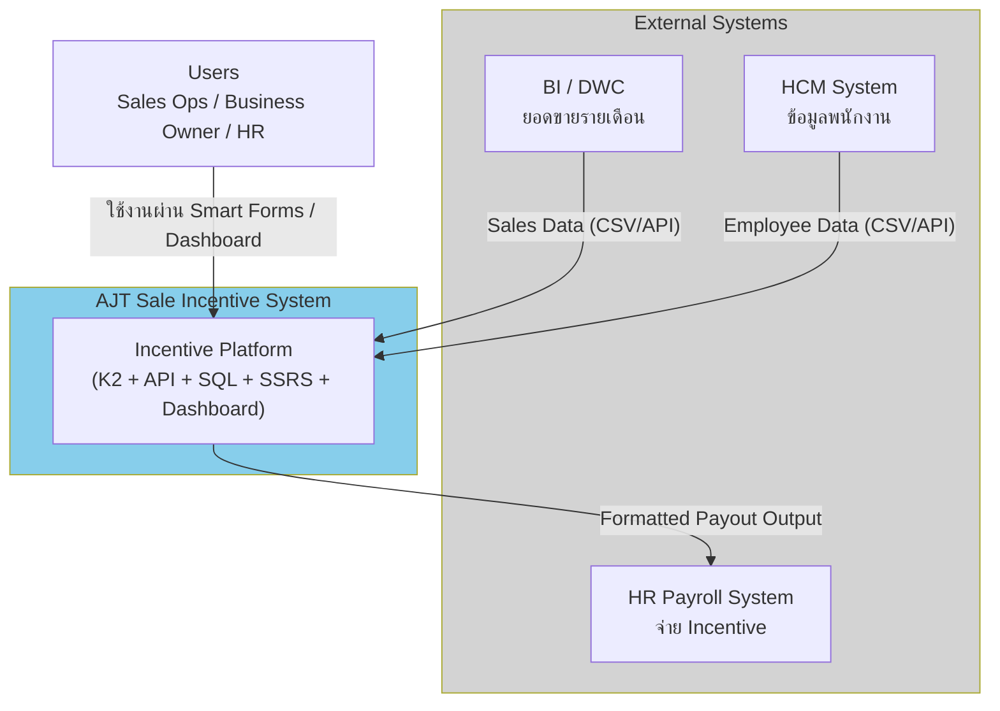
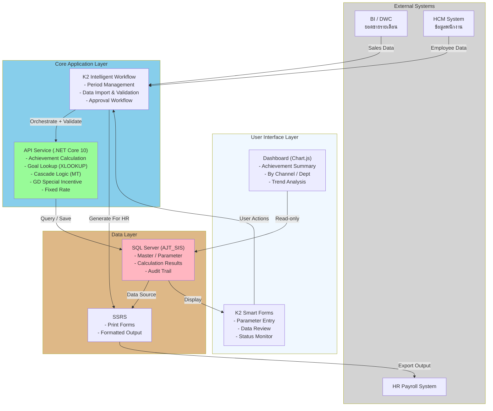
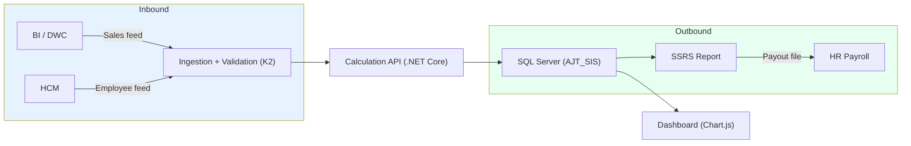
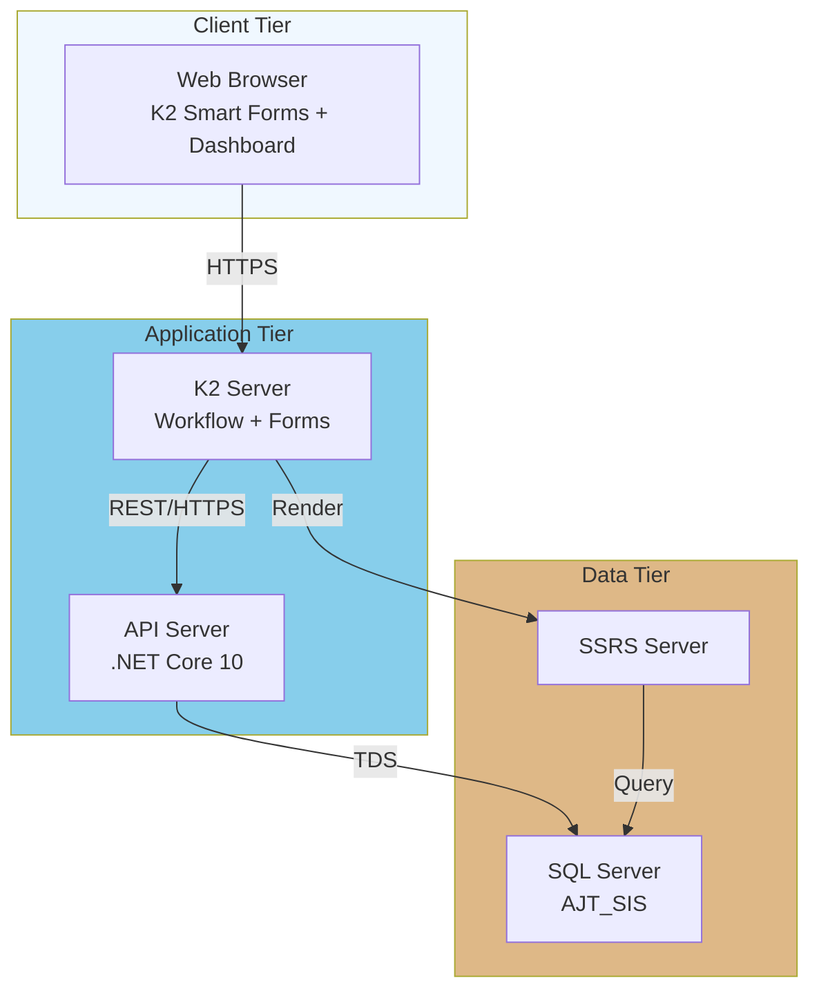

# System Architecture Design — AJT New Sale Incentive

เวอร์ชัน: v1.0
วันที่: 2026-06-13
สถานะ: Complete (Design Baseline)
ขอบเขต: สถาปัตยกรรมระบบคำนวณและส่งออก Sales Incentive (MT/TT) ตาม technology stack ที่กำหนดใน BRD/SRS

อ้างอิงต้นทาง:

- [Sales Incentive System for POC.md](Sales%20Incentive%20System%20for%20POC.md)
- [BRD-SRS_AJT-New-Sale-Incentive_Draft-v0.1_2026-06-12.md](BRD-SRS_AJT-New-Sale-Incentive_Draft-v0.1_2026-06-12.md)
- [environment/AJT_SIS_Database_Design_v1.0_2026-06-13.docx](../environment/AJT_SIS_Database_Design_v1.0_2026-06-13.docx)

---

## 1. วัตถุประสงค์ของเอกสาร

อธิบายสถาปัตยกรรมระบบอย่างสมบูรณ์ ครอบคลุม layer ของระบบ องค์ประกอบหลัก เทคโนโลยีที่ใช้ การเชื่อมต่อกับระบบภายนอก รูปแบบการ deploy ความปลอดภัย และการรองรับ Non-Functional Requirements เพื่อใช้เป็น baseline สำหรับการออกแบบเชิงลึกและการพัฒนา

---

## 2. Technology Stack (ตาม BRD/SRS)

| ชั้น | เทคโนโลยี | บทบาท |
| --- | --- | --- |
| Workflow / Orchestration | Nintex K2 Workflow + Smart Forms | คุมรอบงาน, ฟอร์มกรอกข้อมูล, approval |
| Service / Calculation | .NET Core 10 Service API | เครื่องคำนวณ achievement, GOAL, cascade, GD, fixed |
| Database | Microsoft SQL Server (AJT_SIS) | เก็บ master, ผลคำนวณ, audit trail |
| Reporting / Print | SQL Server Reporting Services (SSRS) | จัดรูปแบบและพิมพ์เอกสารส่ง HR |
| Dashboard | Chart.js | แสดงภาพรวมผลคำนวณรายรอบ |
| Integration | BI/DWC Interface, HCM Interface | นำเข้ายอดขายและข้อมูลพนักงาน |

---

## 3. High-Level Architecture (C4 — Context)

---

## 4. Layered Architecture (Components)

---

## 5. องค์ประกอบและความรับผิดชอบ (Component Responsibilities)

| องค์ประกอบ | ความรับผิดชอบหลัก | หมายเหตุ |
| --- | --- | --- |
| K2 Workflow | คุมสถานะรอบงาน, import, validation, approval | เป็น orchestrator หลัก |
| K2 Smart Forms | จุดกรอกพารามิเตอร์และตรวจข้อมูล | UI ฝั่งผู้ปฏิบัติงาน |
| .NET Core API | เครื่องคำนวณ incentive ทุกชนิด | แยก rule config ออกจาก core |
| SQL Server | source of truth ของ master/result/audit | ฐานข้อมูล AJT_SIS |
| SSRS | จัดรูปแบบและส่งออกผลให้ HR | output formatting |
| Chart.js Dashboard | แสดงภาพรวมเชิงวิเคราะห์ | read-only |

---

## 6. Integration Architecture

| Interface | ทิศทาง | รูปแบบ | ความถี่ |
| --- | --- | --- | --- |
| IR-001 BI/DWC → System | Inbound | CSV/API | รายเดือน |
| IR-002 HCM → System | Inbound | CSV/API | รายเดือน |
| IR-003 System → HR | Outbound | ไฟล์ผลลัพธ์ (SSRS) | รายรอบจ่าย |

---

## 7. Deployment View

---

## 8. Security Architecture

| ด้าน | แนวทาง | อ้างอิง NFR |
| --- | --- | --- |
| Authentication | ผ่านระบบ identity ขององค์กร | NFR-001 |
| Authorization | RBAC แยกสิทธิ์ตามบทบาท (Sales Ops/Owner/HR) | NFR-001 |
| Audit | บันทึกการแก้ไขพารามิเตอร์และการอนุมัติ | NFR-004 |
| Data in transit | เข้ารหัสการสื่อสาร (HTTPS/TDS encryption) | NFR-001 |
| Least privilege | จำกัดสิทธิ์แก้ไขเฉพาะผู้มีอำนาจ | NFR-001 |

---

## 9. การรองรับ Non-Functional Requirements

| NFR | สถาปัตยกรรมรองรับอย่างไร |
| --- | --- |
| NFR-001 Security | RBAC ที่ K2 + encryption ระหว่าง tier |
| NFR-002 Performance | แยก calculation ออกเป็น API ที่ scale ได้ |
| NFR-003 Reliability | validation gate + error notification |
| NFR-004 Auditability | audit table ใน SQL Server |
| NFR-005 Maintainability | แยก rule configuration ออกจาก core |
| NFR-006 Data Quality | pre-check ก่อนคำนวณและก่อนอนุมัติ |

---

## 10. ข้อมูลหลักในฐานข้อมูล (Data Architecture สรุป)

ฐานข้อมูล AJT_SIS (schema dbo) เก็บกลุ่มข้อมูลหลัก:

- Master/Parameter: channel, position level, goal threshold, payment cycle, job function, fix rate, product, GD product/payout, policy rule
- Transaction: sales actual, target, calculation result
- Output: For HR (variable/fixed)
- Audit: parameter change log, approval log

> รายละเอียดโครงสร้างตารางและความสัมพันธ์: ดูเอกสาร [AJT_SIS_Database_Design_v1.0_2026-06-13.docx](../environment/AJT_SIS_Database_Design_v1.0_2026-06-13.docx) และสคริปต์ใน [environment/ddl](../environment/ddl/01_ajt_sis_poc_master_tables.sql)

---

## 11. ความเชื่อมโยงกับเอกสารอื่น

| ต้องการดู | ไปที่ |
| --- | --- |
| กระบวนการธุรกิจ | [Business-Process-Design](Business-Process-Design_AJT-New-Sale-Incentive_v1.0_2026-06-13.md) |
| System Flow MT/TT | [System-Flow-Design](System-Flow-Design_AJT-New-Sale-Incentive_v1.0_2026-06-13.md) |
| Database Design | [environment/ddl](../environment/ddl/01_ajt_sis_poc_master_tables.sql) |

---

## 12. ประเด็นค้างที่กระทบสถาปัตยกรรม (ต้องยืนยัน)

1. แนวทางจ่าย GD (รวม For HR หรือแยกชุด) กระทบ output component และ table posting
2. ขอบเขต Laos Dept (TT AD) กระทบ data model และ export template
3. ระดับการลด Excel transitional ออกจาก data layer ในเฟสถัดไป

> การปิดมติใช้ [Decision-Log_Template_Open-Questions](Decision-Log_Template_Open-Questions_2026-06-13.md)
