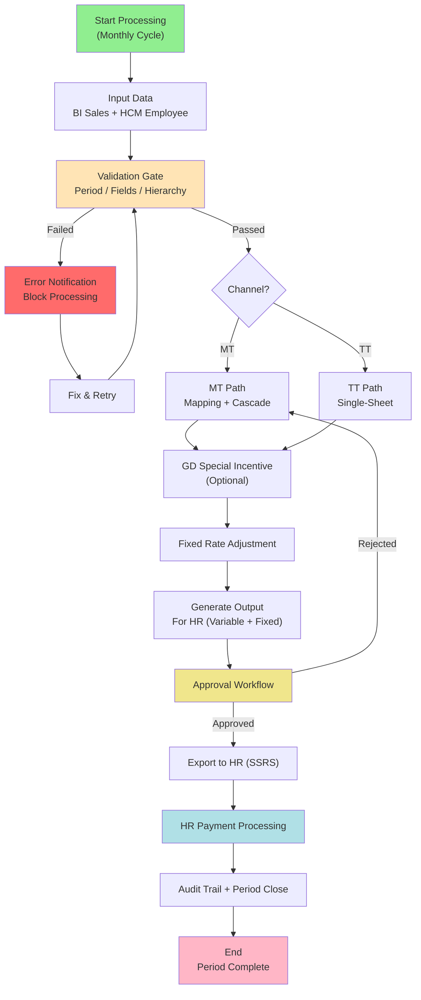
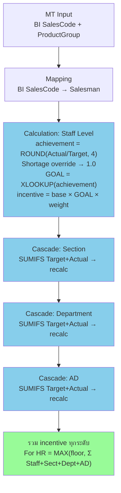
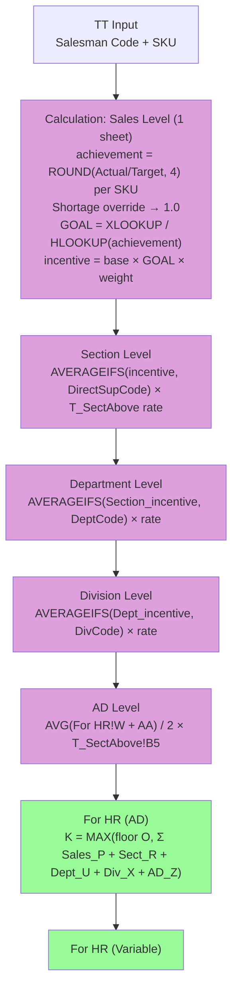
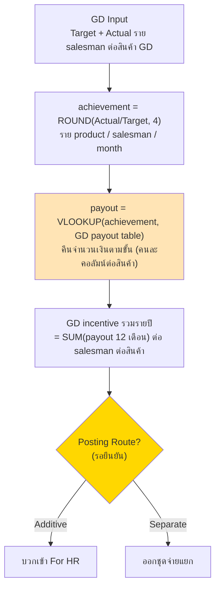
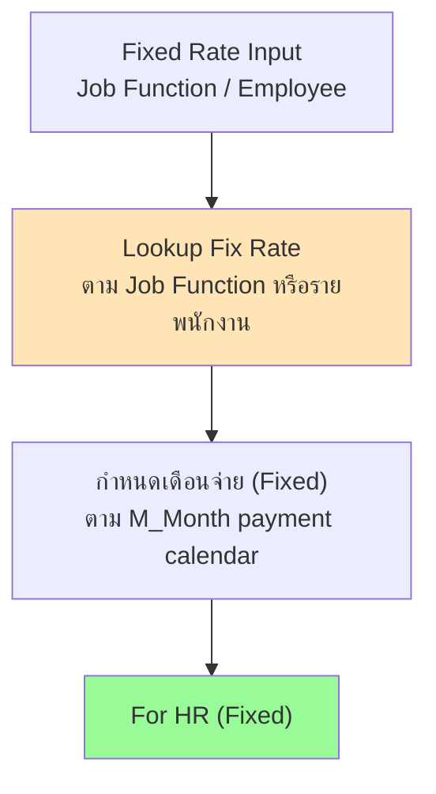
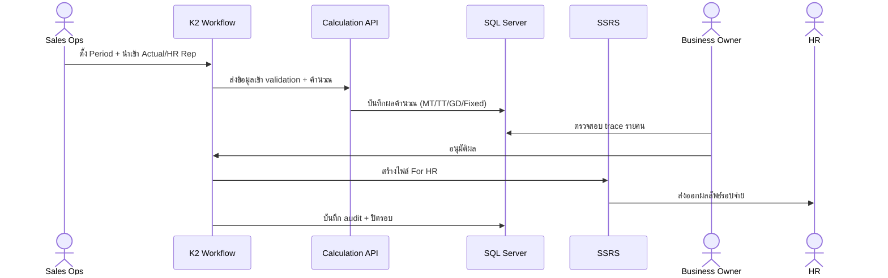
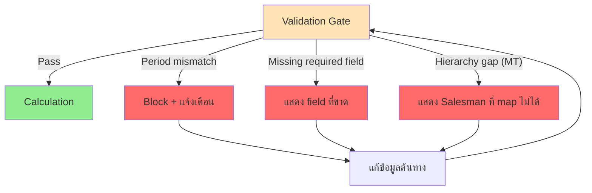
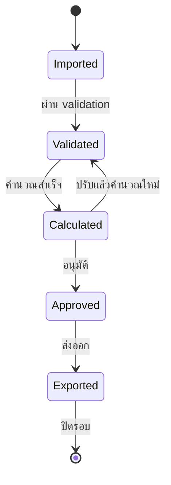

# System Flow Design — AJT New Sale Incentive

เวอร์ชัน: v1.0
วันที่: 2026-06-13
สถานะ: Complete (Design Baseline + Operational Mapping)
ขอบเขต: System Flow ของการประมวลผล Incentive ตามช่องทาง MT และ TT รวม GD และ Fixed Rate

อ้างอิงต้นทาง:

- [Sales Incentive System for POC.md](Sales%20Incentive%20System%20for%20POC.md)
- [4.System Analyst and Design/05.Process-Flow/01_Data-Flow-Diagram.md](../4.System%20Analyst%20and%20Design/05.Process-Flow/01_Data-Flow-Diagram.md)
- [4.System Analyst and Design/03.Calculation-Logic/00_สรุปตรรกะการคำนวณ_ตั้งต้น.md](../4.System%20Analyst%20and%20Design/03.Calculation-Logic/00_%E0%B8%AA%E0%B8%A3%E0%B8%B8%E0%B8%9B%E0%B8%95%E0%B8%A3%E0%B8%A3%E0%B8%81%E0%B8%B0%E0%B8%81%E0%B8%B2%E0%B8%A3%E0%B8%84%E0%B8%B3%E0%B8%99%E0%B8%A7%E0%B8%93_%E0%B8%95%E0%B8%B1%E0%B9%89%E0%B8%87%E0%B8%95%E0%B9%89%E0%B8%99.md)

---

## 1. วัตถุประสงค์ของเอกสาร

อธิบาย System Flow ของการประมวลผล Incentive อย่างสมบูรณ์ ตั้งแต่รับข้อมูลเข้าจนถึงส่งออกให้ HR ครอบคลุมการแยกเส้นทาง MT/TT, การคำนวณ cascade, GD special incentive, fixed rate, การอนุมัติ และ audit เพื่อใช้เป็น baseline สำหรับการพัฒนา calculation engine และการทำ test case

---

## 2. ภาพรวม End-to-End System Flow

---

## 3. MT Channel Flow (4-Level Cascade)

หลักการ MT:

1. ต้องผ่าน Mapping เพราะ 1 บัญชี BI มีหลาย salesman ตาม product group
2. คำนวณที่ระดับ Staff ก่อน แล้ว cascade ขึ้นด้วย SUMIFS และคำนวณใหม่ทุกระดับ
3. ผลรวมรายคนใช้หลัก floor กับผลรวม incentive ทุกระดับ

---

## 4. TT Channel Flow (5-Level Hierarchy ใน Single Sheet)

> ⚠️ **อัปเดตจากหลักฐาน formulas จริง (2026-06-14):** TT ไม่ใช่ "single-sheet ไม่มี cascade" — มี hierarchy ครบ 5 ระดับ ใช้ **AVERAGEIFS** ยืนยันจาก `16_1) For HR (AD).formulas.csv`

หลักการ TT (อัปเดต):

1. ไม่ต้อง Mapping เพราะ Salesman Code ตรงกับยอดขายได้เลย
2. คำนวณทุกระดับ **ใน sheet เดียว** (`3)Target & Cal` + `1) For HR (AD)`) — ต่างจาก MT ที่แยก 4 sheet
3. **ใช้ AVERAGEIFS** ดึงค่า incentive จากระดับล่างขึ้นบน (ต่างจาก MT ที่ใช้ SUMIFS Target+Actual)
4. มี hierarchy ครบ 5 ระดับ: Sales → Section → Department → Division → AD
5. สูตร For HR (AD): `K2 = MAX(floor, P2+R2+U2+X2+Z2)` ✅ ยืนยันจาก formulas.csv

---

## 5. GD Special Incentive Flow

สินค้า GD: Aji Plus, RDQ (Rosdee Cube), RDM (Rosdee Menu), RDNS (Rosdee Noodle)

> Posting route และ anti-double-count กับน้ำหนัก G2 ยังเป็น Open Question — ดู [Decision-Log_Template_Open-Questions](Decision-Log_Template_Open-Questions_2026-06-13.md)

---

## 6. Fixed Rate Flow

หลักการ:

1. Fixed Incentive อิงอัตราคงที่ตาม Job Function/พนักงาน
2. เดือนจ่าย Fixed อ้างอิงจาก M_Month (เร็วกว่า Variable 1 เดือนตามตรรกะที่ยืนยัน)

---

## 7. Sequence — Monthly Processing

---

## 8. Validation & Error Flow

---

## 9. ความต่างหลัก MT vs TT (System View)

> ⚠️ **อัปเดตจากหลักฐาน formulas จริง (2026-06-14):** TT มี hierarchy 5 ระดับ ใช้ AVERAGEIFS — ไม่ใช่ "1 sheet ไม่มี cascade"

| ด้าน | MT | TT |
| --- | --- | --- |
| Mapping | ต้องมี (BI SalesCode → Salesman) | ไม่มี (Salesman Code ตรง) |
| โครงสร้างคำนวณ | **4 sheet** cascade — SUMIFS Target+Actual แล้วคำนวณ achievement ใหม่ | **1 sheet** แต่มี **hierarchy 5 ระดับ** — AVERAGEIFS ดึงค่าขึ้น ✅ |
| จำนวน hierarchy | 4 ระดับ (Staff / Sect / Dept / AD) | **5 ระดับ** (Sales / Section / Dept / Division / AD) ✅ |
| วิธี cascade | SUMIFS (รวม Target+Actual ก่อนคำนวณ) | **AVERAGEIFS** (ดึง incentive จากระดับล่าง) |
| สูตร For HR | `MAX(floor, Σ ทุกระดับ)` | `K2 = MAX(floor O, P2+R2+U2+X2+Z2)` ✅ |
| หน่วยวัด | Product Group | SKU |
| Output | For HR + For HR (FIX) | For HR + For HR (AD) |
| GD | รองรับ | รองรับ |

---

## 10. State ของรายการคำนวณ

---

## 11. Core Formula Reference (ยืนยันแล้ว)

| สูตร | นิยาม |
| --- | --- |
| achievement | ROUND(Actual / Target, 4) ราย product |
| shortage override | ถ้า flag → achievement = 1.0 |
| GOAL | XLOOKUP(achievement, threshold, goal, mode 1) step-down |
| incentive (หลัก) | base × GOAL × weight |
| cascade (MT) | SUMIFS Target+Actual แล้วคำนวณใหม่ทุกระดับ |
| For HR | MAX(floor, Σ incentive ทุกระดับ) |
| GD payout | VLOOKUP(achievement, GD payout table) คืนจำนวนเงินตามขั้น |
| GD รวมรายปี | SUM(payout 12 เดือน) ต่อ salesman ต่อสินค้า |

---

## 12. ความเชื่อมโยงกับเอกสารอื่น

| ต้องการดู | ไปที่ |
| --- | --- |
| BRD/SRS หลัก | [BRD-SRS_AJT-New-Sale-Incentive_Draft-v0.1_2026-06-12](BRD-SRS_AJT-New-Sale-Incentive_Draft-v0.1_2026-06-12.md) |
| กระบวนการธุรกิจ | [Business-Process-Design](Business-Process-Design_AJT-New-Sale-Incentive_v1.0_2026-06-13.md) |
| สถาปัตยกรรมระบบ | [System-Architecture-Design](System-Architecture-Design_AJT-New-Sale-Incentive_v1.0_2026-06-13.md) |
| Data Flow ฝั่ง SA | [01_Data-Flow-Diagram](../4.System%20Analyst%20and%20Design/05.Process-Flow/01_Data-Flow-Diagram.md) |

---

## 13. Control Point Mapping (สอดคล้อง BPD)

ตารางนี้ map จุดใน System Flow เข้ากับ Control Point เดียวกันกับเอกสาร BPD

| Flow Stage | Control Point | เงื่อนไขผ่าน |
| --- | --- | --- |
| INPUT + VALIDATE | CP-1 Period alignment | Sales และ Employee อยู่ใน Period เดียวกัน |
| INPUT + VALIDATE | CP-2 Data completeness | required fields ครบ, key ไม่ซ้ำ |
| MT_PATH | CP-3 Hierarchy consistency | Mapping/Hierarchy ผูกครบถึงสายบังคับบัญชา |
| APPROVAL | CP-4 Approval before export | มีผู้อนุมัติและเวลาอนุมัติก่อน export |
| AUDIT | CP-5 Audit completeness | การแก้ As-needed มี user/time/reason ครบ |
| INPUT (batch) | CP-6 Interface completeness | มี total/valid/error ครบทุก batch |
| MT_PATH + TT_PATH + GD | CP-7 Data reconciliation | ยอดหลัง mapping/recalc reconcile กับต้นทางตาม tolerance |
| OUTPUT + EXPORT | CP-8 Output integrity | จำนวนพนักงานและยอดรวมตรงรอบที่อนุมัติ |
| AUDIT + END | CP-9 Period close governance | ปิดรอบได้เมื่อ Exported และบันทึก audit ครบ |

---

## 14. RACI Mapping ตาม System Flow Stage

| Flow Stage | Sales Ops | Business Owner | HR | Data Team | HCM Owner | System |
| --- | --- | --- | --- | --- | --- | --- |
| START / Period Setup | R/A | C | I | I | I | I |
| INPUT (BI/HCM/AST) | R | I | I | A (BI) | A (HCM) | C |
| VALIDATE | A | I | I | C | C | R |
| MT_PATH / TT_PATH / GD / FIXRATE | C | I | I | I | I | R/A |
| APPROVAL | C | A | I | I | I | R |
| OUTPUT / EXPORT | C | A | R | I | I | R |
| AUDIT / CLOSE | A | C | I | I | I | R |

คำย่อ: R = Responsible, A = Accountable, C = Consulted, I = Informed

---

## 15. KPI/SLA Mapping ตาม Flow

| KPI/SLA | Stage ที่เกี่ยวข้อง | Target |
| --- | --- | --- |
| Data Validation Pass Rate | INPUT + VALIDATE | >= 98% รอบแรก |
| Accuracy เทียบ baseline Excel | MT_PATH / TT_PATH / GD | >= 99.5% |
| Rework Rate หลัง Review | APPROVAL | <= 5% ของรายการที่คำนวณ |
| Export Timeliness | OUTPUT + EXPORT | ภายใน payroll cut-off |
| Monthly Cycle Time | START ถึง END | ภายใน 1 วันทำการหลังข้อมูลครบ |

---

## 16. Traceability (Flow -> FR -> Control)

| System Flow Block | FR หลัก (BRD/SRS) | Control Point |
| --- | --- | --- |
| INPUT + VALIDATE | FR-006 ถึง FR-009 | CP-1, CP-2, CP-6 |
| MT_PATH | FR-010 ถึง FR-014 | CP-3, CP-7 |
| TT_PATH | FR-015 | CP-7 |
| GD | FR-023 ถึง FR-029 | CP-7 |
| FIXRATE | FR-017 | CP-8 |
| OUTPUT | FR-016, FR-018 | CP-8 |
| APPROVAL | FR-019, FR-022 | CP-4 |
| EXPORT | FR-020 | CP-8 |
| AUDIT + CLOSE | FR-021 | CP-5, CP-9 |

---

## 17. ประเด็นค้างที่กระทบ System Flow (ต้องยืนยัน)

1. GD posting route (additive/separate) และ anti-double-count กับน้ำหนัก G2
2. Laos Dept (TT AD) อยู่ในเส้นทางคำนวณเดียวกันหรือแยก
3. Policy จุด 108% → 1.06 ในขั้น GOAL lookup

> การปิดมติใช้ [Decision-Log_Template_Open-Questions](Decision-Log_Template_Open-Questions_2026-06-13.md)
