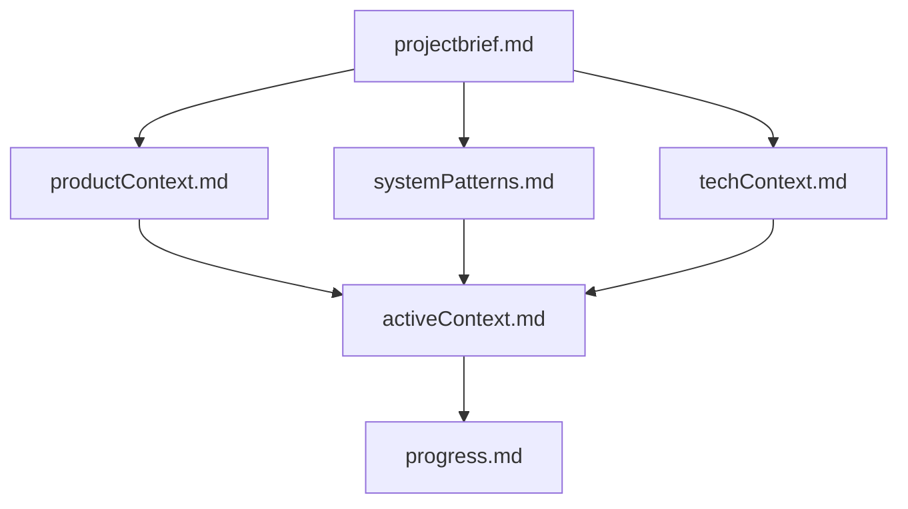

# Memory Bank — คู่มือการใช้งาน

โฟลเดอร์นี้คือ **Memory Bank** ของโปรเจกต์ AJT New Sale Incentive — ใช้โครงสร้างมาตรฐานสากล
(Memory Bank Pattern ที่ AI coding agent หลายตัว เช่น Cline, Roo Code, Claude Code ใช้ร่วมกัน)
เพื่อให้ **AI Agent ตัวไหนก็ตาม** (Copilot, Claude, หรือตัวใหม่ในอนาคต) อ่านแล้วเข้าใจบริบท
โปรเจกต์ทั้งหมดได้ทันที โดยไม่ต้องไล่อ่าน chat-log ย้อนหลังทีละไฟล์

## ทำไมต้องมี Memory Bank

AI agent ไม่มีความจำข้ามเซสชัน (memory resets ทุกครั้งที่เริ่มงานใหม่) ดังนั้น **ความแม่นยำของงาน
ขึ้นอยู่กับ Memory Bank ทั้งหมด** — ต้องอ่านไฟล์ทุกไฟล์ในนี้ก่อนเริ่มงานทุกครั้ง ไม่มีข้อยกเว้น

## โครงสร้างไฟล์ (ลำดับการอ่าน)

ไฟล์ทั้งหมดเชื่อมกันเป็นลำดับชั้น (build on each other):

| ลำดับ | ไฟล์ | เนื้อหา | อัปเดตความถี่ |
|---|---|---|---|
| 1 | [projectbrief.md](./projectbrief.md) | เอกสารรากฐาน — ขอบเขต เป้าหมาย requirement หลักของโปรเจกต์ | นาน ๆ ครั้ง (เมื่อ scope เปลี่ยน) |
| 2 | [productContext.md](./productContext.md) | ทำไมโปรเจกต์นี้ถึงมีอยู่ ปัญหาที่แก้ ผู้ใช้งาน และเป้าหมาย UX | นาน ๆ ครั้ง |
| 3 | [systemPatterns.md](./systemPatterns.md) | สถาปัตยกรรมระบบ, การตัดสินใจเชิงเทคนิคหลัก, design pattern ที่ใช้ | เมื่อมีการเปลี่ยน architecture |
| 4 | [techContext.md](./techContext.md) | เทคโนโลยีที่ใช้, dev setup, ข้อจำกัด, dependencies | เมื่อ stack เปลี่ยน |
| 5 | [activeContext.md](./activeContext.md) | **งานล่าสุดที่ทำอยู่ตอนนี้**, การตัดสินใจล่าสุด, ขั้นตอนถัดไป | **ทุกครั้งที่จบงาน** (ไฟล์สำคัญที่สุด) |
| 6 | [progress.md](./progress.md) | สถานะภาพรวม: อะไรเสร็จแล้ว, อะไรค้าง, known issues | ทุกครั้งที่จบงาน |

## กติกาการทำงานสำหรับ AI Agent

1. **เริ่มงานทุกครั้ง**: อ่านไฟล์ทั้ง 6 ไฟล์ในโฟลเดอร์นี้ก่อน (โดยเฉพาะ `activeContext.md` และ `progress.md`)
2. **ระหว่างทำงาน**: ถ้าพบข้อมูลสำคัญใหม่ (decision, pattern, blocker) ให้จดใน `activeContext.md` ทันที
3. **จบงานทุกครั้ง**:
   - อัปเดต `activeContext.md` ให้สะท้อนสถานะล่าสุด (งานที่ทำ, งานถัดไป)
   - อัปเดต `progress.md` ถ้ามีของใหม่เสร็จ หรือมี blocker ใหม่
   - อัปเดต `systemPatterns.md` / `techContext.md` ถ้ามีการเปลี่ยนแปลงเชิงสถาปัตยกรรม
   - (แนะนำ) เขียน chat-log ตามเดิมใน `../chat-log/` สำหรับบันทึกละเอียดรายเซสชัน
4. **ห้ามลบประวัติสำคัญ** — ถ้าข้อมูลเก่าไม่ตรงกับปัจจุบันแล้ว ให้ย้ายไปหัวข้อ "Superseded/History" แทนการลบทิ้ง
5. **ห้ามเก็บรหัสผ่าน/secret จริงในไฟล์นี้** — อ้างอิงตำแหน่งไฟล์ env แทน (ดู techContext.md)

## ความสัมพันธ์กับโฟลเดอร์อื่น

| โฟลเดอร์ | บทบาท | ต่างจาก memory-bank อย่างไร |
|---|---|---|
| `../chat-log/` | บันทึกละเอียดรายเซสชัน (chronological log) | เก็บทุกเหตุการณ์แบบ append-only, ไม่สรุปรวม |
| `memory-bank/` (นี่) | **สถานะปัจจุบันแบบสรุป** ที่พร้อมอ่านต่อได้ทันที | เขียนทับ/ปรับปรุงต่อเนื่อง (living document) ไม่ใช่ log |
| `../docs/` | เอกสารทางการของโปรเจกต์ (BRD, SA Design, Test Plan) | เอกสารส่งมอบ ไม่ใช่บริบทการทำงานของ AI |

> อ่าน `memory-bank/` เพื่อ "รู้ตอนนี้อยู่ตรงไหน" แล้วค่อยเปิด `chat-log/` เฉพาะเมื่อต้องการรายละเอียด
> เชิงลึกของการตัดสินใจในอดีต
