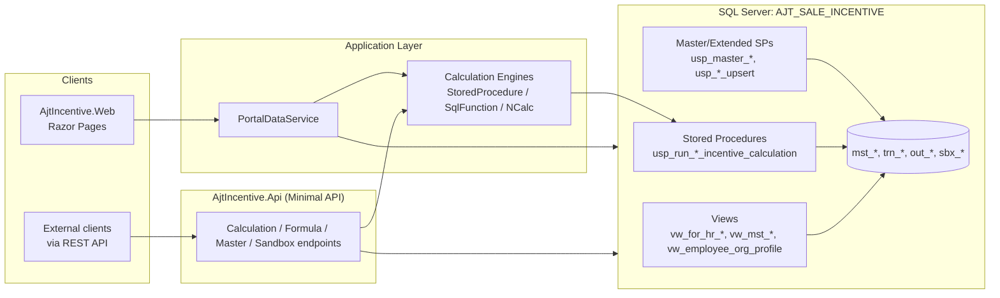

# System Patterns — AJT New Sale Incentive

## สถาปัตยกรรมโดยรวม

โปรเจกต์เป็น 4 layer csproj (Domain, Application, Infrastructure, Web) + 1 API project แยก
(AjtIncentive.Api) ที่เรียกใช้ Application layer เดียวกัน

## Design Pattern หลักที่ใช้

### 1. Multi-Engine Calculation Strategy (สำคัญที่สุด)
แต่ละ channel มี 3 engine ให้เลือกใช้ (config-driven ผ่าน `CalculationEngine:{Channel}`):

| Engine | คำอธิบาย | สถานะ |
|---|---|---|
| `StoredProcedure` | เรียก SP เดิม (`usp_run_{channel}_incentive_calculation`) | **Default/Active ทุก channel** |
| `SqlFunction` | ห่อ SP เดิมด้วย SQL function wrapper (DDL 51/53) | LAOS ✅, SI ✅ parity validated, MT foundation พร้อม |
| `NCalc` | คำนวณ logic เดียวกันด้วย NCalc formula evaluation แทน SP | LAOS ✅, SI ✅ parity validated (diff=0 vs baseline) |

Pattern: `I{Channel}CalculationEngine` interface → 3 implementation classes →
`{Channel}CalculationEngineFactory` → DI (`Program.cs`) เลือก engine ตาม config
**Default ทุก channel ต้องเป็น `StoredProcedure` เสมอ** (เป็น safe fallback ที่ validate แล้วนานที่สุด)

**สำหรับ channel ใหม่ (Channel 5+)**: ใช้ `IGenericChannelCalculationEngine` — table-driven,
อ่าน target/actual + master policy + formula ตาม `channel_id` โดยไม่ต้อง hardcode logic ใหม่
(พิสูจน์แล้วด้วย test channel `CH5TEST`)

### 2. Centralized Writes ผ่าน Stored Procedures (ไม่ใช้ raw SQL จาก C# โดยตรง)
ทุก path ที่เขียนข้อมูล master/transaction ต้องผ่าน SP ที่ centralize business rule
(FK check, unique/duplicate check, overlap date validation, soft delete ผ่าน `is_active=0`)
ไม่เขียน dynamic SQL / MERGE ตรงจาก C# อีกต่อไป (refactor เสร็จ 2026-07-03)

- Master data: `usp_master_{table}_upsert` / `usp_master_{table}_deactivate` (14 SPs)
- Extended data: `usp_master_period_upsert`, formula (`usp_formula_upsert_version`/`set_active`/
  `delete`/`clone_channel`), sales target, prorate, special adjustment, sandbox (14 SPs)
- อ้างอิง signature ทั้งหมด: `database/` (ดู SP reference markdown)

### 3. View-per-Channel Pattern สำหรับ For HR Export
`vw_for_hr_{channel}_sheet` (tt/si/laos) — join master + transaction + calc flags
(`is_std_formula`, `has_prorate`, `has_special_adj`) ให้พร้อมแสดงในหน้า ForHR โดยไม่ต้อง
ประมวลผลใน C#

### 4. Org Hierarchy Resolution Pattern (สำคัญ — เคยเป็นบั๊ก)
`mst_employee.employee_code` (HR ID เช่น `000004`) **ไม่ใช่** ID เดียวกับ
`mst_org_hierarchy.salesman_code` (Sales ID เช่น `110000`) — ต้อง join ผ่าน column
`mst_employee.salesman_code` (เพิ่มเข้ามาทีหลังใน DDL 48) ไม่ใช่ employee_code ตรง ๆ

View `vw_employee_org_profile` (DDL 47/48) resolve ชื่อ Division/Department/Section โดย:
- Division: match `div_mgr_code` → ถ้า NULL (ตัวเองคือ Div Mgr) → fallback เป็น own salesman_code
- Department: match `dept_mgr_code` → fallback แบบเดียวกัน
- Section: match `direct_sup_code` (staff/supervisor) → ถ้า NULL (ตัวเองคือ Section Mgr) →
  fallback เป็น own salesman_code
- ใช้ `mst_org_unit` (channel_id, unit_type: DIVISION/DEPARTMENT/SECTION, unit_code, unit_name)
  เป็นตาราง lookup ชื่อ org unit — **ไม่มี column ชื่อ org ใน mst_employee/mst_org_hierarchy โดยตรง**

### 5. Formula Engine (NCalc) — ข้อควรระวัง
NCalc **ต้องใช้ชื่อฟังก์ชันแบบ PascalCase** เช่น `Round(x, 2)` ไม่ใช่ `ROUND(x, 2)` (uppercase SQL-style)
มี normalization logic ที่ SandboxApiService และ FormulaApiService แต่ต้องระวังเวลาสร้าง formula
expression ใหม่ผ่าน UI/API — พิมพ์ชื่อฟังก์ชันผิด case จะ evaluate fail แบบเงียบ ๆ

### 6. Sandbox Pattern สำหรับทดสอบ Formula
`sbx_calc_run`, `sbx_incentive_detail`, `sbx_for_hr_variable` — ตารางแยกจาก transaction จริง
(`trn_*`, `out_for_hr_*`) เพื่อให้ทดสอบ formula ใหม่ได้โดยไม่กระทบข้อมูลจริง มี compare API
เทียบผล sandbox vs production run

## Security / Auth Pattern (REST API)

- API Key auth (header-based) เป็นพื้นฐาน + Role-based policy (5 policies):
  `CanRunCalculation`, `CanEditFormula`, `CanEditMaster`, `CanRunSandbox`, `CanManageChannel`
- Multi-client: config-driven role mapping ต่อ API key, fallback เป็น single-key ถ้าไม่ตั้งค่า (backward compatible)
- Rate limiting: 60 req/min ต่อ key/IP
- Global exception handler: error envelope มาตรฐาน + correlation ID สำหรับ trace
- Audit logging: บันทึก method/path/status/elapsed time ทุก request

## Testing Pattern

- Integration tests ผ่าน `ApiWebApplicationFactory` (WebApplicationFactory pattern มาตรฐาน .NET)
- DB integration tests เป็น opt-in ผ่าน environment variable (ไม่รันอัตโนมัติทุกครั้งเพราะต้องต่อ DB จริง)
- Regression toolkit แยกต่อ channel: `test-scenarios/regression-toolkit/{mt,si,laos}/` — เก็บ SQL
  scripts + C# runner project สำหรับเทียบผล parity ระหว่าง engine
